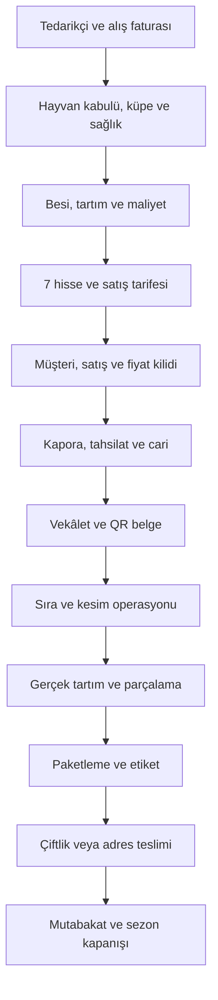
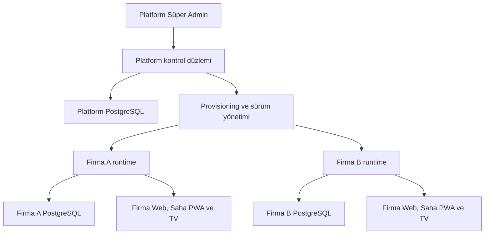

# TilbeCore – Kurban Takip

```yaml
id: GOV-ROOT-002
status: IMPLEMENTING
owner: Product-and-Architecture
source_role: repository_entrypoint_and_product_overview
source_of_truth: false
last_reviewed: 2026-08-12
verified_against_commit: 74915b6f3f1f8d53116b760b6a6be9797111efa5
```

> Büyükbaş kurban işletmeleri için hayvan tedarikinden sezon kapanışına kadar satış, finans ve kesim operasyonunu tek zincirde yöneten; mobil saha kullanımı, yerel ağ dayanıklılığı ve çok firma veri izolasyonu hedefli profesyonel yönetim platformu.

[](https://nextjs.org/)
[](https://react.dev/)
[](https://www.typescriptlang.org/)
[](https://www.prisma.io/)
[](https://nodejs.org/)
[](#lisans)

**Ürün adı:** TilbeCore – Kurban Takip  
**Teknik kod adı:** `tilbecore-kurban`  
**İlk operasyon odağı:** Sakarya / Serdivan  
**Temel kapsam:** Yalnız büyükbaş kurban  
**Ana çalışma modeli:** Web + masaüstü + tablet + role özel mobil PWA  
**Dağıtım hedefi:** Yönetilen merkezi veya yerel/hibrit kurulum

---

## İçindekiler

- [Ürün amacı](#ürün-amacı)
- [Güncel proje durumu](#güncel-proje-durumu)
- [Uçtan uca ana akış](#uçtan-uca-ana-akış)
- [Dört ana omurga](#dört-ana-omurga)
- [360° kart yaklaşımı](#360-kart-yaklaşımı)
- [Modüller](#modüller)
- [Kesim günü operasyon merkezi](#kesim-günü-operasyon-merkezi)
- [Mimari](#mimari)
- [Teknoloji yığını](#teknoloji-yığını)
- [İleri teknoloji hedefleri](#ileri-teknoloji-hedefleri)
- [Veri ve finans bütünlüğü](#veri-ve-finans-bütünlüğü)
- [PWA, çevrimdışı çalışma ve gerçek zaman](#pwa-çevrimdışı-çalışma-ve-gerçek-zaman)
- [Güvenlik ve KVKK](#güvenlik-ve-kvkk)
- [Yedekleme ve felaket kurtarma](#yedekleme-ve-felaket-kurtarma)
- [Kalite hedefleri](#kalite-hedefleri)
- [Kurulum](#kurulum)
- [Geliştirici komutları](#geliştirici-komutları)
- [Yol haritası](#yol-haritası)
- [Bilinen kritik açıklar](#bilinen-kritik-açıklar)
- [Belgeleme](#belgeleme)

---

## Ürün amacı

TilbeCore Kurban’ın başarı ölçüsü yalnızca kayıt tutmak değildir. Sistem, bir hayvanın satın alınmasından yedi hissesinin müşterilere eksiksiz teslimine kadar oluşan her önemli olayı tek ve denetlenebilir bir zincirde yönetmelidir.

> Hayvan, hisse, müşteri, fiyat, borç, tahsilat, vekâlet, kesim sırası, gerçek tartım, paket ve teslim kayıtları kaybolmadan, iki kez uygulanmadan ve birbirinden kopmadan ilerlemelidir. Cari, kasa, banka/POS ve raporlar aynı finans kaynağından sıfır farkla üretilmelidir.

Ürün özellikle Kurban Bayramı günündeki yüksek yoğunluğa göre tasarlanır:

- Kritik işlem az dokunuşla tamamlanır.
- Ekranlar göreve ve role göre sadeleşir.
- Aynı kayıt üzerinde eşzamanlı işlem güvenli biçimde engellenir.
- Ağ kesintisi, çift tıklama, cihaz kapanması ve kullanıcı hatası veri kaybına dönüşmez.
- Her kritik değişiklik geri alınabilir veya ters kayıtla düzeltilebilir.
- TV ve müşteri takip ekranları kişisel ya da finansal veri sızdırmaz.

---

## Güncel proje durumu

Bu bölüm, **10 Ağustos 2026** tarihli repo ve uygulama takip kayıtlarını özetler. Durum işaretleri şu anlama gelir:

| İşaret | Anlamı |
|---|---|
| ✅ | Kodlandı ve ilgili takip kaydında doğrulandı |
| 🧪 | Kod/sözleşme mevcut; genel entegrasyon veya canlı kabul doğrulaması bekliyor |
| 🚧 | Aktif geliştirme sürüyor |
| 📋 | Planlandı, henüz uygulamaya bağlanmadı |
| ⛔ | Bilinçli olarak kapsam dışında |

| Alan | Durum | Açıklama |
|---|---:|---|
| P0 güvenlik ve teknik stabilizasyon | ✅ | API yetkileri, kritik transaction’lar, idempotency, korumalı vekâlet dosyaları, hata kataloğu ve UTF-8 kapısı tamamlandı |
| Mevcut tek işletme operasyonu | ✅ | Müşteri, hayvan/hisse, tahsilat, kasa, rapor, PWA, TV ve temel kesim takibi çalışıyor |
| Modüler monolit sınırları | ✅ | Domain/application/infrastructure yönü ve workspace paket sınır testleri kuruldu |
| Platform PostgreSQL temeli | 🧪 | Platform domaini, şema, migration ve repository temeli var; gerçek PostgreSQL CI/canlı kanıtı tamamlanmadan hazır sayılmaz |
| Firma başına ayrı PostgreSQL | 🧪 | Tenant sözleşmesi ve veritabanı başlangıcı var; mevcut ekranların tamamı yeni altyapıya taşınmış değil |
| Müşteri, satış ve ledger çekirdeği | 🧪 | Decimal tabanlı yeni sözleşmeler kodlandı; eski SQLite akışlarıyla tam bütünleşme bekliyor |
| Vekâlet, kesim, tartım, paket, teslim | 🧪 | Yeni domain sözleşmeleri ve migration temeli mevcut; tüm saha ekranlarına uçtan uca bağlanması gerekiyor |
| Operasyon merkezi ve observability | 🧪 | KPI, istisna kuyruğu, trace ve release gate sözleşmeleri var; çalışma zamanı araçları tamamlanmadı |
| Canlıya hazır sürüm | 🚧 | Restore provası, gerçek cihaz testleri, yük testi, kesim günü simülasyonu ve kabul kapıları tamamlanmadan ilan edilmez |

> **Önemli:** `Belgelendi`, `kodlandı`, `test edildi` ve `canlıya hazır` aynı durum değildir. README’deki hiçbir hedef, kabul kanıtı olmadan tamamlanmış sayılmaz.

---

## Uçtan uca ana akış



Hayvan, yedi hissenin tamamı teslim edilmeden kapanmaz. Satış, tahsilat, kasa, vekâlet, kesim, paketleme ve teslim olayları ayrı ekranlarda kopuk kayıtlar değil; birbirini güvenli biçimde ilerleten tek operasyon zinciridir.

---

## Dört ana omurga

| Omurga | Kapsam |
|---|---|
| **Hayvan ve tedarik** | Tedarikçi, alış faturası, kabul, benzersiz küpe, sağlık/uygunluk, besi, tartım geçmişi, gerçek alış bedeli, kurban numarası, hisse oluşturma |
| **Müşteri ve satış** | Müşteri, mükerrer uyarısı, rezervasyon, hisse eşleştirme, fiyat snapshot’ı, indirim, kapora, sözleşme, vekâlet, iptal ve transfer |
| **Finans** | Tahakkuk, sezon carisi, karma ödeme, tahsilat dağıtımı, nakit, banka, POS, iade, mahsup, ters kayıt, kasa açılış/kapanış ve mutabakat |
| **Kesim ve teslim** | Hazırlık, ön koşullar, sıra, kesim, karkas, parçalama, hisse tartımı, paketleme, etiket, çiftlik/adres teslimi ve kapanış |

---

## 360° kart yaklaşımı

Her ana kart, ilgili kayda ait yalnızca bilgiyi göstermemeli; o kayıtla yapılabilecek günlük işlemlerin merkezi olmalıdır.

### Müşteri kartı

- Kimlik, telefon, adres, not ve etiketler
- Aynı telefon/ad-soyad için engellemeden mükerrer uyarısı
- Tüm sezon geçmişi; aktif sezon carisi ayrı
- Satın aldığı tüm hisseler ve hayvan bağlantıları
- Borç, tahsilat, iade, mahsup ve ekstre
- Ödeyen kişi ile hissedar ayrımı
- Vekâlet durumları ve belgeleri
- Dekont, sözleşme, QR ve yeniden yazdırma geçmişi
- Teslimat tercihi, teslim noktası ve geçmiş teslimler
- Tek ekrandan satış, ödeme, not, belge ve iletişim işlemleri

### Hayvan kartı

- Benzersiz küpe, tedarikçi, alış faturası ve gerçek alış bedeli
- Kabul, sağlık, uygunluk, gözlem/tedavi ve pasiflik geçmişi
- Tarihli canlı ağırlık ve tartım kayıtları
- Kurban numarası ile değişebilir operasyon sırasının ayrılması
- Tam yedi hisse, doluluk, müşteri ve borç görünümü
- Vekâlet ve kesime hazırlık kontrol listesi
- Kesim zaman çizelgesi ve darboğaz süreleri
- Karkas, toplam et, randıman ve gerçek paket toplamları
- Yedi teslim tamamlanınca kontrollü kapanış

### Hisse kartı

- Hisse şablonu/sınıfı ve vaat aralığı
- Liste fiyatı, indirim, net anlaşma bedeli ve fiyat kilidi
- Sahiplik, devir ve iptal geçmişi
- Cari, tahsilat dağılımı ve kalan borç
- Ayrı vekâlet durumu ve kanıtı
- Kesim/teslim belgesi ile iki aşamalı QR
- Kemikli, kemiksiz, ciğer/sakatat ve değerli parça tartımları
- Alt paketler ile tek dış paket ilişkisi
- Vaat altı kilo düzeltmesi ve bağlı finans kaydı
- Çiftlik/adres teslimi, tek kullanımlık teslim onayı ve audit izi

---

## Modüller

### 1. Platform ve firma yönetimi

- Platform Süper Admin ile Firma Admin’in ayrı kimlik ve oturum alanları
- Firma oluşturma, provisioning, lisans, plan, modül hakkı ve sürüm kanalı
- Firma başına ayrı operasyon veritabanı
- Sağlık sinyali, migration, kapasite ve yedek metadata takibi
- Süreli, gerekçeli, firma onaylı ve çift audit’li destek oturumu
- İlk canlıda tek lokasyon; gelişmiş çok şube için `Location` temeli

### 2. Sezon yönetimi

- Sezon açılış sihirbazı ve kontrol listesi
- Fiyat/tarife, kapora son tarihi, belge şablonları ve işletme ayarları
- Aktif sezonun zorunlu bağlam olması
- Eski sezonun kilitlenmesi ve sessiz bakiye taşımama
- Sezon arşivi, kapanış mutabakatı ve değişmez rapor snapshot’ı

### 3. Müşteriler, rezervasyon ve satış

- Hızlı arama ve `Ctrl+K` komut paleti
- Mevcut müşteri seçme veya uyarıya rağmen yeni kişi oluşturma
- Bir müşteriye birden fazla hisse satışı
- Liste fiyatı, indirim, hizmet bedeli, vade farkı ve net satışın ayrı izlenmesi
- Pozitif kapora ile kesin satış; kaporasız rezervasyonun son tarihte süre sonu olayıyla kapanması ve hissenin işletme envanterine açılması
- Hisse transferi ve eski sahiplik/fiyat geçmişinin korunması
- Satılmayan hisselerin sahte müşteri, satış, gelir, alacak veya vekâlet üretmeden işletme envanterinde kalması; kesim öncesi dinî uygunluk çözümünün açık karar olarak izlenmesi

### 4. Tedarikçi, alış ve hayvan kabulü

- Tekli/toplu alış faturası
- Tedarikçi borcu ve ödeme takibi
- Hayvan bazında gerçek alış bedeli
- Nakliye, veteriner ve diğer giderlerin çift yazılmadan dağıtılması
- Küpe, fotoğraf, sağlık belgesi, tartım, uygunluk ve padok hareketi
- Uygunsuz hayvanda boş hisseleri pasifleştirme; satılmış hisseyi sessizce taşımama

### 5. Tahsilat, cari ve gelişmiş kasa

- Nakit + banka/havale + POS aynı makbuzda
- Tek tahsilatı bir veya birden fazla hisse borcuna dağıtma
- Eşit, öncelikli veya manuel ödeme dağıtımı
- Tahsilatın tamamını atomik transaction içinde kaydetme
- Günlük kasa açılış/kapanış, sayım ve fark kaydı
- Banka/POS hesabı, komisyon, valör ve mutabakat
- İade, iptal ve hatada fiziksel silme yerine bağlantılı ters kayıt
- A5/A4 makbuz, benzersiz numara, QR doğrulama ve yeniden basım izi
- Borçlular, tahsilat, kasa ve sezon raporlarını Excel/PDF dışa aktarma

### 6. Vekâlet ve belge yönetimi

- Her hisse için ayrı vekâlet durumu
- Yüz yüze sözlü, telefon veya WhatsApp ses kaydı yöntemi
- Vekâlet veren ile hissedarın farklı olabilmesi
- Tek kanıtın yetkili şekilde birden fazla hisseye bağlanması
- Kesim öncesi yedi geçerli vekâlet kontrolü
- Sürümlü A4 belge ve iptal edilebilir QR token
- Hassas dosyaların `public/` dışında tutulması ve yetkili API ile sunulması

### 7. Kesim, tartım, paketleme ve teslim

- Merkezi durum makinesi ve kontrollü aşama geçişi
- Gerekçeli, yetkili ve audit’li yönetici istisnası
- Kurban no değişmeden operasyon sırası düzenleme
- Hayvan bazlı süreç; tartımdan sonra hisse bazlı ayrışma
- Her hisse ve alt bileşen için gerçek baskül tartımı
- Paket/alt paket, A4 etiket ve QR ilişkisi
- Çiftlikten veya adrese teslim
- Tek seferlik teslim tokenı ve mükerrer teslim engeli
- Yedi teslimden sonra hayvan kapanışı

### 8. Raporlar ve operasyon zekâsı

- Satış, doluluk, borç, tahsilat ve finans mutabakatı
- Eksik vekâlet, belge, tartım, paket ve teslim istisnaları
- Kesim aşama süreleri, yoğunluk ve darboğaz görünümü
- Hayvan/hisse kârlılığı ve sezon karşılaştırması
- Kullanıcı, cihaz, audit ve şüpheli işlem raporları
- Raporların ekranlardan ayrı hesaplar yerine kaynak kayıt/ledger’dan üretilmesi

---

## Kesim günü operasyon merkezi

Kesim merkezi ürünün ana çalışma yüzeyidir. Yönetim panelinin küçültülmüş bir kopyası değil, yüksek stres altında görev tamamlatan role özel ekranlar bütünüdür.

### Kontrollü durum akışı

Önerilen ana durumlar:

`BEKLEMEDE → VEKALET_KONTROL → SIRADAKI → HAZIRLIK → KESIMDE → DERI_YUZME → PARCALAMA → TARTIM → PAKETLEME → TESLIME_HAZIR → TAMAMLANDI`

- Normal akışta aşama atlanamaz.
- Eksik vekâlet veya uygunsuz hayvan kesime başlayamaz.
- Override yalnız yetkili kullanıcı, gerekçe ve audit ile yapılır.
- Her geçiş kullanıcı, cihaz, zaman ve önceki/sonraki durumla kaydedilir.
- Sıra değişikliği kurban numarasını değiştirmez.
- Geri alma işlemi serbest durum yazımı değil, izinli ters geçiştir.

### Role özel saha ekranları

| Rol | Birincil görevler |
|---|---|
| **Operasyon sorumlusu** | Genel akış, sıra, gecikme, istisna, override ve acil durum |
| **Vekâlet kontrol** | QR okutma, yedi hisse uygunluğu ve eksik kanıt yönetimi |
| **Kesim görevlisi** | Başlat/bitir, aşama geçişi ve sorun bildirimi |
| **Tartım görevlisi** | Hisse/bileşen tartımı, baskül doğrulama ve düzeltme |
| **Paketleme görevlisi** | Alt paket, dış paket, etiket ve paket tamamlama |
| **Teslim görevlisi** | Tek kullanımlık QR, borç/istisna uyarısı, teslim kanıtı |
| **Kasiyer** | Hızlı tahsilat, karma ödeme, makbuz ve kasa |
| **TV/müşteri** | Yalnız kurban numarası, aşama ve tahmini durum; PII/finans yok |

### Canlı görünüm

- SSE ile tek yönlü, hafif ve otomatik yeniden bağlanan canlı güncelleme
- `Last-Event-ID`/olay sırası ile kaçan olayları telafi etme
- Bağlantı durumu, son güncelleme zamanı ve bayat veri uyarısı
- Operasyon kartlarında aşamada geçen süre ve hedef süre
- Bekleyen, devam eden, geciken ve sorunlu hayvanların ayrı görünümü
- Tahmini bekleme süresi yalnız yardımcı bilgi; insan onayı yerine geçmez
- TV ekranında kişisel veri yerine kurban numarası ve anonim durum

### Acil durum ilkesi

- Ağ kesilirse kritik finans, satış, kesim onayı veya teslim işlemi başarı göstermez.
- Yerel taslak/kuyruk kaydı ile kullanıcıya açıkça “sunucuya gönderilmedi” durumu gösterilir.
- Sunucu geri geldiğinde aynı komut idempotency anahtarıyla güvenli biçimde denenir.
- Kâğıt/QR acil durum listesi, yedek cihaz ve manuel mutabakat prosedürü runbook’ta tutulur.

---

## Mimari

### Modüler monolit

İlk ve orta ölçek için mikroservis yerine modüler monolit kullanılır:

```text
UI / API  →  Application  →  Domain
                         ←  Infrastructure adapters
```

- Domain; Next.js, React, Prisma, HTTP ve dosya sisteminden bağımsızdır.
- Route dosyaları yalnız doğrulama, auth/yetki, use-case çağrısı ve güvenli cevap koordinasyonu yapar.
- İş kuralları React bileşenlerine veya API route’larına yığılmaz.
- Modüller tipli sözleşmeler, portlar ve açık olaylarla haberleşir.
- Audit ve outbox kritik transaction ile birlikte yazılır.

### Kontrol ve operasyon düzlemi



Platform veritabanı firma operasyon verisini tutmaz. Her firma kendi PostgreSQL veritabanında müşteri, finans, hayvan, hisse, belge, kesim ve teslim verisini saklar.

### Geçiş dönemi

Repo şu anda iki dünyayı birlikte taşır:

1. **Mevcut operasyon çekirdeği:** Tek işletme, yerel SQLite ve çalışan saha ekranları.
2. **Hedef ürün mimarisi:** Platform PostgreSQL + firma başına ayrı PostgreSQL + yerel/hibrit runtime.

Bu geçiş tamamlanana kadar SQLite şeması “nihai profesyonel veri modeli” kabul edilmez. Çalışan akışlar korunarak küçük, testli ve geri alınabilir paketlerle taşınır.

---

## Teknoloji yığını

### Repoda bugün bulunanlar

| Katman | Teknoloji |
|---|---|
| Web | Next.js `16.2.6`, App Router, React `19.2.4` |
| Dil | TypeScript strict, TypeScript `5.9.x` |
| Arayüz | Tailwind CSS v4, shadcn, Base UI, Lucide, Sonner |
| Mevcut DB | Prisma `6.19.3` + SQLite |
| Hedef DB paketleri | Prisma tabanlı Platform PostgreSQL ve Tenant PostgreSQL |
| Kimlik | `iron-session` + `bcrypt` |
| Doğrulama | Zod v4 |
| PWA | `next-pwa`, manifest, service worker, Web Push |
| Gerçek zaman | SSE tabanlı TV/kesim güncellemeleri |
| Belgeler | QRCode, jsPDF, html2canvas, XLSX |
| Test | Vitest; PostgreSQL entegrasyon testi için ayrılmış CI kapısı |
| Paket yönetimi | pnpm `11.2.2` workspace |

### Sürüm politikası

- Production, major sürüm adıyla değil güvenlik yamalı doğrulanmış patch sürümüyle çalışır.
- Next.js 16 için güvenlik destekli 16.x hattı izlenir; repo sürümü yükseltmeden önce build, PWA ve regresyon testlerinden geçer.
- Node.js 24 LTS önerilir; `package.json` sınırı `>=22.12 <25` korunur veya ADR ile değiştirilir.
- Prisma 7 geçişi; driver adapter, ESM, migration ve SQLite/PostgreSQL uyumluluğu kanıtlanmadan yapılmaz.
- Lockfile commitlenir; production kurulumu `pnpm install --frozen-lockfile` kullanır.

---

## İleri teknoloji hedefleri

### Öncelikli teknik geliştirmeler

| Teknoloji / yaklaşım | Beklenen kullanım | Durum |
|---|---|---:|
| **PostgreSQL 16+** | Platform DB ve firma başına izole operasyon DB’si | 🚧 |
| **Decimal/Numeric** | Para `Numeric(14,2)`, kilo `Numeric(10,3)`; `Float` kaynaklı hata riskini kaldırma | 🚧 |
| **Transactional Outbox** | İş verisi, audit ve entegrasyon olayını aynı transaction’da güvenceye alma | 🧪 |
| **Optimistic concurrency** | Hisse, sıra, paket ve teslimde `version` kontrolüyle eşzamanlı çakışmayı engelleme | 🧪 |
| **Idempotency** | Çift tıklama/ağ tekrarıyla ikinci tahsilat veya teslim oluşmasını engelleme | ✅/🚧 |
| **Maintained PWA worker** | Next.js 16 uyumlu service worker; `next-pwa` bağımlılığından kontrollü çıkış | 📋 |
| **IndexedDB işlem kuyruğu** | Çevrimdışı taslak ve güvenli yeniden deneme; kritik işlemde açık bekleme durumu | 🧪 |
| **SSE event replay** | TV ve saha ekranında heartbeat, reconnect ve kaçan olayı geri alma | 🚧 |
| **OpenTelemetry** | Trace, metric ve hata korelasyonu; kullanıcı/secret maskeleme | 🧪 |
| **Playwright + axe** | Uçtan uca tarayıcı, gerçek mobil viewport ve WCAG 2.2 AA kontrolleri | 📋 |
| **k6 veya eşdeğeri** | LAN eşzamanlı kullanıcı, hızlı tahsilat ve SSE yük testi | 📋 |
| **Property-based test** | Ledger dengesi, dağıtım toplamı, durum makinesi ve kilo hesaplarında invariant testi | 📋 |
| **Passkey/WebAuthn + MFA** | Platform Süper Admin ve yüksek yetkili firma hesapları | 🧪 |
| **SBOM, SLSA, CodeQL** | Yazılım tedarik zinciri, bağımlılık ve build bütünlüğü | 🚧 |
| **Canary + geri alma** | Firma/sürüm bazlı güvenli yayın ve hızlı rollback | 🧪 |

### Saha ve donanım adaptörleri

- Kamera ile QR/barkod okuma
- El tipi 2D barkod okuyucu desteği
- Baskül entegrasyonu için Web Serial/WebUSB veya yerel donanım köprüsü
- A4 yazdırma; ileride termal/ZPL etiket adaptörü
- UPS, yedek erişim noktası ve yedek sunucu cihazı sağlık kontrolü
- Cihaz kaydı, cihaz yetkisi ve kayıp cihaz oturum iptali
- Donanım yoksa manuel giriş + ikinci doğrulama + audit geri dönüşü

### Yardımcı yapay zekâ ve görüntü işleme

İleri fazda aşağıdaki özellikler adaptör olarak eklenebilir:

- Küpe numarası OCR ve çift okuma uyarısı
- Alış faturası/belge OCR ile taslak veri çıkarma
- Bekleme süresi ve operasyon darboğaz tahmini
- Olağandışı tahsilat, kilo veya teslim farkı uyarısı
- Doğal dille rapor filtresi ve yönetici özeti
- Sesli/hands-free saha komutları

Yapay zekâ; satış, finans, vekâlet, kesim uygunluğu veya teslim onayını tek başına vermez. Yalnız öneri üretir; kesin işlem yetkili insan ve değişmez kayıtla tamamlanır.

---

## Veri ve finans bütünlüğü

### Değişmez kurallar

- Küpe numarası hayvanın benzersiz kimliğidir.
- Her büyükbaş tam yedi hisseye ayrılır.
- Bir hisse aynı anda yalnız bir aktif satışa bağlı olabilir.
- Bir müşteri birden çok hisse alabilir.
- Aynı telefon farklı aile bireylerinde kullanılabilir; sistem engellemez, uyarır.
- Satış anındaki fiyat snapshot olarak kilitlenir; sonraki tarife değişikliğinden etkilenmez.
- Ödemeli/hareket görmüş kayıt fiziksel silinmez.
- Finans hatası iade, mahsup, iptal veya ters kayıtla düzeltilir.
- Kritik komut iş verisi, ledger, audit ve outbox ile tek transaction’da tamamlanır.
- Para için `Float` kullanılmaz; kuruş tabanlı tam sayı veya `Decimal/Numeric` kullanılır.
- Kilo sabit hassasiyetli decimal tipte tutulur.

### Çift taraflı iç defter

Hedef finans kaynağı:

- `JournalEntry`
- `JournalLine`
- `Receipt`
- `ReceiptMethodSplit`
- `PaymentAllocation`
- `Refund`
- `Adjustment`

Bir fişte borç toplamı alacak toplamına eşit değilse transaction tamamlanmaz. Müşteri carisi, kasa, banka/POS ve raporlar aynı ledger’dan türetilir.

### Kilo farkı

Vaat edilen aralığın üstünde çıkan et müşteriye ek ücret olmadan verilir. Altında kalırsa hedef düzeltme formülü:

```text
kilo farkı düzeltmesi = net anlaşma bedeli ÷ vaat alt sınırı × eksik kg
```

Örnek: 40 kg alt sınır, 44.000 TL net satış ve 2 kg eksik için `44.000 ÷ 40 × 2 = 2.200 TL` düzeltme oluşur. Bu sonuç elden silinen bir bakiye değil, bağlı ledger adjustment kaydıdır.

---

## PWA, çevrimdışı çalışma ve gerçek zaman

### PWA hedefi

- Ana ekrana kurulabilir standalone deneyim
- 48–56 px dokunma alanları ve yüksek okunabilirlik
- Role göre yalnız gerekli dört temel görevin öne çıkarılması
- QR tarama için sabit ve hızlı erişim
- Ağ, sunucu ve senkronizasyon durumunun açık gösterilmesi
- Son güvenli okuma verilerinin kontrollü önbelleği
- Kurban günü ekranlarının önceden hazırlanmış offline shell’i

### Çevrimdışı güvenlik sınırı

| İşlem | Çevrimdışı davranış |
|---|---|
| Liste/son güvenli durum görüntüleme | Kontrollü cache ile mümkün |
| Not veya taslak veri girişi | Yerel kuyrukta bekleyebilir |
| Tahsilat ve iade | Sunucu commit’i olmadan başarılı sayılmaz |
| Satış/hisse atama | Sunucu kilidi olmadan kesinleşmez |
| Kesim başlangıç/onayı | Sunucuya ulaşmadan tamamlanmaz |
| Teslim QR kapatma | Sunucu doğrulaması olmadan teslim edildi sayılmaz |

Her yeniden denemede aynı `clientRequestId` kullanılır. Kullanıcıya “kaydedildi”, “cihazda bekliyor” ve “başarısız” durumları birbirinden farklı gösterilir.

### LAN ve HTTPS

Telefon/tablet erişimi LAN üzerinden sağlanabilir. Kamera, PWA ve güvenli cookie özelliklerinin tamamı için production’da güvenilir HTTPS gerekir. Yerel dağıtımda reverse proxy, yerel DNS, güvenilir sertifika ve sabit sunucu IP’si kurulum planının parçasıdır.

---

## Güvenlik ve KVKK

- Platform ve firma oturumları ayrı cookie/namespace kullanır.
- Her API kimlik, rol, izin ve firma sınırı kontrolü yapar.
- UI’daki gizleme yetki kontrolü yerine geçmez.
- Hassas belge ve ses kayıtları `public/` altında tutulmaz.
- Müşteri takip URL’leri tahmin edilemez, süreli/iptal edilebilir token kullanır.
- TV ekranı müşteri adı, telefon, adres, borç veya finans göstermez.
- Parola, secret, bağlantı bilgisi, ham hata ve stack trace loga/istemciye çıkmaz.
- Oturum iptali, cihaz yönetimi, giriş deneme sınırı ve yüksek yetkili hesaplarda MFA hedeflenir.
- Kritik işlemde kullanıcı, firma, sezon, cihaz, IP, request ID, gerekçe ve önceki/sonraki değer audit’e yazılır.
- KVKK aydınlatma, açık rıza, saklama süresi, erişim ve silme/anonimleştirme politikaları firma bazında yönetilir.
- Güvenlik kabul hedefi en az **OWASP ASVS Level 2**’dir.

Repo güvenliği:

- `.env`, `*.db`, WAL/SHM, yedekler, yüklemeler ve gerçek müşteri seed verisi commitlenmez.
- Örnek seed dosyaları yalnız sentetik veri içerir.
- Bağımlılık güncellemeleri otomatik birleşmez; CI ve güvenlik kontrolünden geçer.
- Release artefaktı için provenance/SBOM ve gizli bilgi taraması hedeflenir.

---

## Yedekleme ve felaket kurtarma

### Mevcut SQLite yedeği

- Her kritik ödeme sonrası ve zamanlanmış aralıkta yedek alınabilir.
- Çalışan veritabanında ham dosya kopyası yerine WAL-güvenli `VACUUM INTO` kullanılır.
- Yedekler 30 gün / son 50 dosya politikasıyla döndürülür.
- Kullanıcı etiketli yedek noktaları otomatik rotasyondan korunur.

### Zorunlu geliştirmeler

- `PRAGMA integrity_check` ile gerçek SQLite bütünlük kontrolü
- Temiz geçici ortama otomatik restore provası
- Tablo/satır/invariant doğrulaması ve SHA-256 dosya özeti
- Yerel disk dışında şifreli USB/NAS yedeği
- Yedek başarısızlığında dashboard + sesli/görsel alarm
- Yedek almanın değil, geri yüklemenin düzenli kanıtlanması
- PostgreSQL için base backup + WAL/PITR ve firma bazlı restore
- Her migration öncesi yedek, geri dönüş planı ve restore testi

### Operasyon hedefleri

| Ölçüt | Hedef |
|---|---|
| **RPO** | Kritik işlem için mümkün olan en düşük kayıp; ödeme/teslimde transaction + olay kaydı |
| **RTO** | Yerel yedek sunucuyla 15 dakika içinde temel operasyonu ayağa kaldırma hedefi |
| **Yedek doğrulama** | Günlük otomatik bütünlük, sezon öncesi tam restore provası |
| **Harici kopya** | En az bir şifreli ve sunucu dışı kopya |

---

## Kalite hedefleri

### Performans ve dayanıklılık

| Hedef | Kabul ölçütü |
|---|---|
| Hızlı müşteri arama | LAN’da p95 ≤ 300 ms |
| Kritik komut yanıtı | LAN’da p95 ≤ 500 ms; uzun işlerde açık ilerleme durumu |
| TV güncellemesi | Normal koşulda ≤ 2 saniye |
| Çift işlem | Aynı idempotency anahtarında ikinci finans/teslim kaydı oluşmaması |
| Eşzamanlı satış | Aynı hissenin iki kullanıcıya satılamaması |
| Uzun çalışma | En az bir tam operasyon günü süreli soak test |
| Erişilebilirlik | WCAG 2.2 AA hedefi + gerçek cihaz/elle kontrol |

### Zorunlu test katmanları

- Domain unit testleri
- Ledger ve durum makinesi invariant testleri
- SQLite ve gerçek PostgreSQL entegrasyon testleri
- Firma izolasyonu ve IDOR testleri
- Race condition ve idempotency testleri
- API auth/yetki testleri
- Playwright kritik kullanıcı akışları
- Mobil viewport, kamera/QR ve baskül/yazıcı adaptör testleri
- SSE kopma, yeniden bağlanma ve event replay testleri
- Backup/restore ve migration rollback testleri
- Yük, spike, soak ve ağ kesintisi testleri
- Kurban Günü prova/simülasyon kabulü

### Canlıya çıkış kapısı

Bir sürüm ancak aşağıdakiler birlikte geçtiğinde canlıya hazırdır:

1. Typecheck, lint, unit, integration ve production build başarılı.
2. Gerçek PostgreSQL migration/drift doğrulaması başarılı.
3. Kritik mobil ve masaüstü E2E akışları başarılı.
4. Güvenlik, PII sızıntısı ve yetki testleri başarılı.
5. Yedekten geri dönüş provası kanıtlı.
6. Gerçek saha cihazlarıyla kesim günü simülasyonu başarılı.
7. Bilinen P0/P1 açık yok; rollback planı hazır.

---

## Kurulum

### Gereksinimler

- Node.js `>=22.12 <25` — önerilen: Node.js 24 LTS
- pnpm `>=11 <12`
- Mevcut tek işletme modu için SQLite
- Platform/tenant entegrasyon testleri için PostgreSQL 16+
- Production LAN kurulumu için sabit IP, reverse proxy ve güvenilir HTTPS

### Yerel geliştirme

```bash
# 1. Repoyu klonla
git clone https://github.com/tilbehome/kurban2026.git
cd kurban2026

# 2. Bağımlılıkları kilit dosyasına göre yükle
pnpm install --frozen-lockfile

# 3. Ortam dosyasını oluştur
cp .env.example .env

# 4. En az şu değerleri güvenli biçimde doldur
# SESSION_SECRET              en az 32 karakter
# ADMIN_INITIAL_PASSWORD      en az 12 karakter
# DEKONT_DOGRULAMA_SECRET     en az 32 karakter

# 5. Mevcut SQLite veritabanını oluştur
pnpm prisma migrate dev --name init

# 6. Sentetik/yerel seed uygula
pnpm db:seed

# 7. Geliştirme sunucusunu başlat
pnpm dev:local     # yalnız localhost
pnpm dev           # LAN: 0.0.0.0
```

İlk kullanıcı `admin`’dir. Parola `.env` içindeki `ADMIN_INITIAL_PASSWORD` ile seed sırasında oluşturulur ve ilk girişten sonra değiştirilmelidir.

### LAN erişimi

```bash
pnpm dev
```

- Windows: `ipconfig`
- macOS/Linux: `ip addr` veya `ifconfig`
- Telefon/tablet: `http://192.168.1.X:3000`

`dev` yalnız geliştirme içindir. Canlı kullanım `pnpm build` + `pnpm start`, process supervision, HTTPS, sağlık kontrolü ve otomatik yeniden başlatma ile yapılmalıdır.

---

## Geliştirici komutları

```bash
pnpm dev                         # LAN'a açık geliştirme
pnpm dev:local                   # Yalnız localhost
pnpm dev:https                   # Deneysel HTTPS geliştirme
pnpm build                       # Next.js production build (mevcut: Webpack)
pnpm start                       # Production sunucusu, 0.0.0.0
pnpm lint                        # ESLint
pnpm exec tsc --noEmit           # TypeScript kontrolü
pnpm check:utf8                  # Bozuk Türkçe/UTF-8 taraması
pnpm validate:docs               # Salt-okunur metadata/envanter/link/secret kalite kapısı
pnpm validate:docs:write         # GOV-012 envanterini açıkça yeniden üretir
pnpm test:docs                   # Validator yanlış-başarı fixture testleri
pnpm test                        # Vitest
pnpm test:watch                  # Vitest watch
pnpm test:platform-postgres      # Gerçek PostgreSQL entegrasyon testi
pnpm db:migrate                  # Prisma development migration
pnpm db:push                     # Yalnız kontrollü geliştirme ortamı
pnpm db:seed                     # Seed
pnpm db:studio                   # Prisma Studio
```

Gerçek platform PostgreSQL testi:

```bash
RUN_PLATFORM_POSTGRES_TESTS=1 \
PLATFORM_TEST_DATABASE_URL="postgresql://..." \
pnpm test:platform-postgres
```

---

## Klasör yapısı

```text
kurban2026/
├── app/                          # Next.js sayfa ve route adaptörleri
├── modules/                      # Mevcut modüler iş akışları
│   ├── _core/
│   ├── musteriler/
│   ├── hayvanlar/
│   ├── tahsilat/
│   ├── kasa/
│   ├── raporlar/
│   └── tv/
├── packages/                     # Yeni ürün/platform sınırları
│   ├── config/
│   ├── contracts/
│   ├── platform/
│   ├── database-platform/
│   ├── tenant-core/
│   ├── database-tenant/
│   ├── tenant-runtime/
│   └── operations/
├── shared/                       # Geçiş dönemi paylaşılan bileşen/kütüphane
├── components/ui/                # UI primitives
├── prisma/                       # Mevcut SQLite şeması ve migration'lar
├── docs/
│   ├── architecture/             # Bağlayıcı mimari ve takip belgeleri
│   ├── adr/                      # Mimari karar kayıtları
│   ├── runbooks/                 # Canlı operasyon/acil durum rehberleri
│   └── archive/legacy/           # Tarihsel belgeler
├── scripts/                      # Migration, UTF-8, PWA ve işletim araçları
└── backups/                      # Yerel, git dışı yedekler
```

---

## Yol haritası

| Faz | Kapsam | Durum |
|---|---|---:|
| **1 / P0** | Güvenlik, yetki, transaction, idempotency, vekâlet dosyası, UTF-8 ve hata kataloğu | ✅ |
| **2A** | Workspace, mimari sınırlar, domain ayrıştırma, domain/origin ve tenant sözleşmeleri | ✅ |
| **2B** | Platform domaini, PostgreSQL, Süper Admin kimlik/rol ve control-plane metadata | 🚧/🧪 |
| **2C–2D** | Tenant çözümleme, firma DB, sezon, müşteri, tedarikçi, hayvan ve hisse çekirdeği | 🚧/🧪 |
| **3–6** | Satış, fiyat kilidi, cari, ledger, tahsilat, kasa, banka/POS ve finans mutabakatı | 🚧/🧪 |
| **7–10** | Vekâlet, belge, QR, kesim motoru, tartım, paketleme, teslim ve offline sözleşmeleri | 🚧/🧪 |
| **11–12** | Operasyon merkezi, raporlar, observability, güvenlik kabulü, release ve simülasyon | 🚧/🧪 |
| **Canlı kabul** | Restore, yük/soak, gerçek cihaz ve tam Kurban Günü provası | 📋 |
| **İleri ürün** | Çok şube, resmî WhatsApp/SMS, termal yazıcı, rota/GPS, AI ve dış entegrasyonlar | 📋 |

### İlk canlı sürümde zorunlu

- Firma/tenant izolasyonu ve firma admini
- Sezon, müşteri carisi, tedarikçi, alış, gider ve hayvan kabulü
- Yedi hisse, satış, fiyat kilidi, kapora, iptal ve transfer
- Ledger, karma tahsilat, kasa, banka/POS ve mutabakat
- Vekâlet, A4 belge ve iki aşamalı QR
- Kontrollü kesim sırası ve durum motoru
- Gerçek hisse tartımı, paket ve kilo farkı düzeltmesi
- Çiftlik/adres teslimi ve tek seferlik kapanış
- Role özel saha PWA, anonim TV ve tokenlı müşteri takip
- Audit, rapor, yedek, restore ve canlı prova

### İlk canlıdan sonra

- Self-service firma kaydı, abonelik ve otomatik faturalama
- Gelişmiş çok şube/lokasyon
- Resmî WhatsApp Business, SMS ve e-posta otomasyonu
- Termal etiket, rota, GPS ve gelişmiş teslim kanıtı
- Özel parçalama tercihleri ve soğuk oda stoku
- Yem/reçete ve ayrıntılı besi maliyeti
- İleri İK/vardiya
- AI tahminleri ve özel rapor üreticisi
- e-Fatura, muhasebe, banka/POS ve üçüncü taraf API’leri

### Kapsam dışı

- Küçükbaş kurban
- Adak ve akika
- Genel kasap/et satış ERP’si
- İlk sürümde mikroservis karmaşıklığı
- Finans kayıtlarını fiziksel silerek düzeltme
- Gerçek müşteri/veritabanı dosyasını GitHub’a koyma
- Yalnız sayfa sayısını artırmak için işlevsiz placeholder ekranlar

---

## Bilinen kritik açıklar

| Konu | Mevcut durum | Gerekli aksiyon |
|---|---|---|
| Ürün/firma markası | README’de Tilbehome, bazı UI/env değerlerinde Ada Bereket metni bulunuyor | Ürün markası ile firma markasını merkezi ayarlardan kesin ayır |
| Next.js güvenlik patch’i | Repo `16.2.6` kullanıyor | Desteklenen güvenlik yamalı 16.x sürüme yükselt ve regresyon testlerini çalıştır |
| PWA build zinciri | `next-pwa` nedeniyle production build Webpack kullanıyor; tip uyumsuzluğu bastırılmış | Next.js 16 uyumlu aktif service worker çözümüne kontrollü geçiş yap |
| Eski para/kilo modeli | Mevcut SQLite şemasında bazı alanlar `Float` | Decimal/Numeric modele migration + veri mutabakatı yap |
| Çok firma hedefi | Platform/tenant paketleri var; tüm ekranlar yeni runtime’a bağlı değil | Ekran ve route’ları tenant bağlamına aşamalı taşı |
| PostgreSQL kabulü | Test ve CI kapısı mevcut; canlı kanıt tamamlanmadan hazır değil | Migration, drift, isolation ve restore testlerini gerçek DB’de doğrula |
| SQLite WAL sürümü | Çok bağlantılı WAL için kullanılan gömülü SQLite sürümü açıkça doğrulanmıyor | SQLite `3.51.3+` veya resmi backport düzeyini doğrula |
| Yedek doğrulama | `VACUUM INTO` güvenli; doğrulama şu an ağırlıkla boyut/header kontrolü | `integrity_check` + otomatik restore + invariant doğrulaması ekle |
| Observability | Sözleşmeler var; OpenTelemetry çalışma zamanı kurulumu tamamlanmadı | Trace/metric/log, redaction ve yerel health dashboard’u bağla |
| E2E/erişilebilirlik | Vitest var; Playwright/axe paketi henüz hedef | Kritik akışları gerçek tarayıcı ve cihazlarda kapat |
| Offline sync | PWA cache ve offline sözleşmeleri var; tüm kritik çakışma UX’i tamamlanmadı | IndexedDB kuyruk, idempotent replay ve kullanıcıya açık bekleme durumunu tamamla |

---

## Belgeleme

Kaynak önceliği ve çelişki çözümünün tek ana kaynağı [`GOV-003`](docs/governance/GOV-003-KAYNAK-ONCELIGI-VE-KANIT-STANDARDI.md) belgesidir. Bu README aktif depo girişidir; normatif iş kuralı veya mimari karar kaynağı değildir. Aktif çekirdek belge yolları [`docs/README.md`](docs/README.md) indeksinden açılır.

Teknik referanslar:

- [Next.js 16](https://nextjs.org/blog/next-16) ve [PWA rehberi](https://nextjs.org/docs/app/guides/progressive-web-apps)
- [React 19.2](https://react.dev/blog/2025/10/01/react-19-2)
- [Prisma ORM ve SQLite](https://docs.prisma.io/docs/orm/v6/overview/databases/sqlite)
- [SQLite WAL](https://www.sqlite.org/wal.html) ve [Online Backup API](https://www.sqlite.org/backup.html)
- [OWASP ASVS](https://owasp.org/www-project-application-security-verification-standard/)
- [OpenTelemetry JavaScript](https://opentelemetry.io/docs/languages/js/)
- [Playwright](https://playwright.dev/docs/intro)

---

## Veri gizliliği

- Gerçek `seed-data.json`, `.env`, SQLite/PostgreSQL dump, yedek, müşteri belgesi ve yüklenen dosyalar repoya eklenmez.
- Demo/fixture verileri sentetik olmalıdır.
- Ekran görüntüsü, log ve test artefaktı paylaşılmadan önce PII ve secret temizliği yapılır.

---

## Lisans

**Özel ve kapalı kaynak kullanım — Tilbehome / TilbeCore.**

Yazılımın kopyalanması, dağıtılması, yeniden lisanslanması veya ticari olarak kullanılması hak sahibinin yazılı iznine tabidir.

