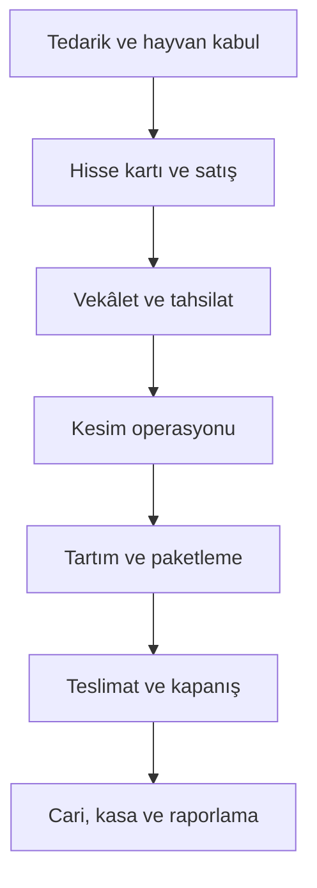
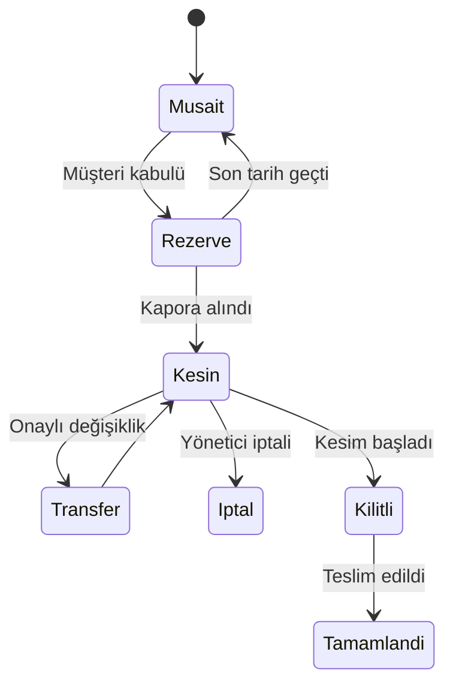
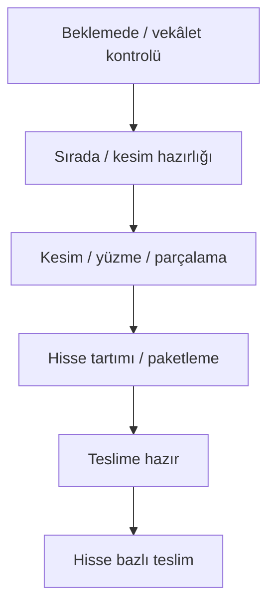
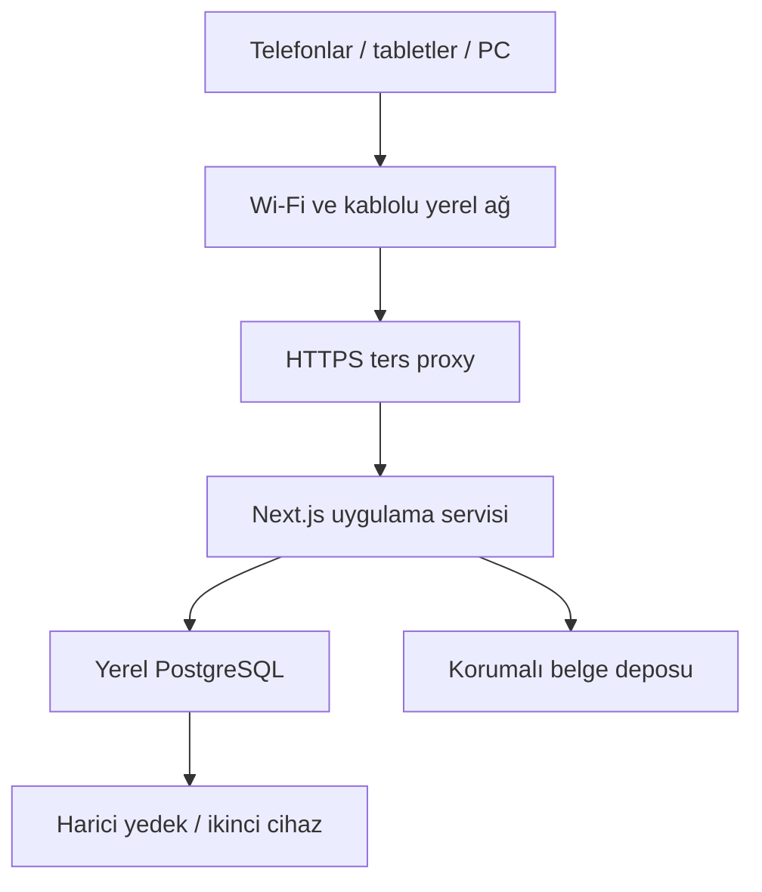

# Kurban 2026 — Ana Analiz, Hedef Mimari ve Geliştirme Yol Haritası

**Tarih:** 7 Ağustos 2026
**İncelenen depo:** [tilbehome/kurban2026](https://github.com/tilbehome/kurban2026)
**İncelenen sürüm:** `main` / `ffc809d`
**Kapsam:** Kod, veritabanı, muhasebe, iş akışları, masaüstü ve mobil arayüz, yerel sunucu, güvenlik, yedekleme, test, veri taşıma ve canlıya geçiş.

> Bu belge geliştirmeyi başlatan ana sözleşmedir. Henüz kaynak kod değiştirilmemiştir. Önce doğru hedef belirlenmiş, ardından aşamalı uygulama planı hazırlanmıştır.

## 1. Yönetici kararı

Mevcut uygulama çöpe atılmayacak; çalışan parçalar korunacak fakat mevcut veritabanı ve iş kuralları üzerine rastgele özellik eklenmeyecek. Sistem, **kontrollü yeniden yapılandırma** yöntemiyle geliştirilecek.

Ana hedef şudur:

Bu zincirdeki her kritik işlem:

- tek bir iş kuralı servisinden yürütülecek,
- veritabanında atomik tamamlanacak,
- para ve stok/operasyon etkisini birlikte oluşturacak,
- silinmek yerine ters kayıtla düzeltilecek,
- kullanıcı, cihaz, zaman, önceki ve sonraki değerleriyle denetim kaydına alınacak,
- masaüstü ve mobilde aynı iş kuralını kullanacak.

## 2. Doğrulanmış mevcut durum

| Ölçüm | Sonuç |
|---|---:|
| TypeScript/React/Next.js kaynak kodu | Yaklaşık 54.700 satır |
| Sayfa rotası | 126 |
| API rotası | 73 |
| Gerçek işlev yerine “yakında” ekranı | 67 sayfa |
| Test dosyası | 3 |
| Mevcut test | 71 / 71 başarılı |
| TypeScript kontrolü | Başarılı |
| ESLint | 48 hata, 39 uyarı |
| Üretim derlemesi | Doğru ortam değişkenleriyle başarılı |

Teknik temel tamamen kötü değildir. Next.js 16, React 19, TypeScript, Prisma, oturum, rol kontrolleri, idempotency anahtarı, atomik dekont sayacı, WAL ayarları, bazı transaction'lar, audit kayıtları, TV ekranı ve PWA temeli vardır. Ancak ekran sayısının yarısından fazlası yalnızca menü/placeholder görünümündedir; “çok özellik varmış” izlenimi işlevsel bütünlük anlamına gelmemektedir.

### Çalışan ve korunacak parçalar

- Next.js App Router ve TypeScript temeli
- shadcn/Tailwind bileşen yaklaşımı
- Oturum açma ve temel rol kontrolü
- Mevcut müşteri/hayvan listeleme ve arama parçaları
- Tahsilat dağıtımı yardımcıları, idempotency ve dekont sayacı
- TV ekranı, SSE ve personel panelinin kullanılabilir fikirleri
- A4 dekont/rapor üretim bileşenleri
- Audit, yedekleme ve olay sisteminin iyi fikirleri
- PWA manifesti, mobil alt navigasyon ve saha satış sihirbazı başlangıcı

### Yeniden tasarlanması gereken çekirdek parçalar

- Veritabanı ve para modeli
- Sezon ve cari hesap mimarisi
- Hisse kartı, satış, kapora, iptal ve transfer modeli
- Tedarikçi, alış faturası ve gider modeli
- Vekâlet ve belge/QR modeli
- Kesim aşama makinesi ve geçiş kuralları
- Gerçek hisse/paket tartımı
- Teslimat doğrulaması
- Yetki matrisi
- Dosya güvenliği
- Yerel sunucu ve felaket yedeği
- Masaüstü ve mobil bilgi mimarisi

## 3. Kritik mevcut sorunlar

### P0 — Para ve veri bütünlüğü

1. **Hisse iptal kuralları çelişkili.** Bir API ödemeli hisseyi çıkarmayı engellerken diğer API hisseyi boşaltıp ödemeyi hisse üzerinde bırakıyor. Bu, müşteri ekstresi ve kasa uyuşmazlığı üretebilir.
2. **Satış ve kapora tek transaction değildir.** Saha satış sihirbazı önce hisseyi atıyor, sonra tahsilat yapıyor; tahsilat hata verirse satış açık kalıyor ve arayüz manuel düzeltme istiyor.
3. **Hisse atamada yarış koşulu vardır.** İki kullanıcı aynı boş hisseyi eşzamanlı seçerse okuma ve yazma arasında sahip değişebilir.
4. **Para alanları `Float` kullanıyor.** Kuruş hassasiyeti veritabanı düzeyinde garanti edilmemektedir.
5. **Tek gerçek cari defter yoktur.** Bakiye, değişebilir hisse fiyatı ve ödeme toplamlarından yeniden hesaplanıyor; satış, indirim, iade, kilo farkı ve vade farkının güvenilir muhasebe kaynağı bulunmuyor.
6. **Bir tahsilatın çok kişiye/hisseye dağıtımı yanlış seviyede modellenmiştir.** Aynı gerçek para hareketi birden fazla `Odeme` kaydına bölünüyor; ödeme belgesi ile borç kapatma dağıtımı birbirinden ayrılmalıdır.

### P0 — Kesim ve teslim zinciri

1. Tartım ekranı yalnızca hayvanın toplam kilosunu alıp otomatik olarak hisse sayısına bölüyor. Gerçek uygulamada her hissenin paketleri ayrı tartılmaktadır.
2. Hayvan `tamamlandi` yapıldığında bütün hisseler otomatik teslim edilmiş sayılabiliyor. Teslim her hisse için ayrı QR/işlem olmalıdır.
3. Aşamalar doğrudan istenen duruma geçirilebilir; vekâlet, belge, tartım ve paket şartlarını zorlayan merkezi geçiş kuralları yoktur.
4. `durum`, `kesimDurumu`, `paketDurumu` ve `teslimDurumu` alanları farklı metinlerle aynı gerçeği tekrarlar; zamanla birbirinden kopabilir.
5. Kayıp belge iptali, belge sürümü ve iki ayrı kullanım olayı (kesimi başlatma / teslim alma) modellenmemiştir.

### P0 — Yetki ve gizlilik

1. Bazı hisse ve kasa API'leri sadece oturum kontrolü yapıyor, gereken özel izni kontrol etmiyor.
2. Vekâlet dosyaları `public/uploads` altında tutuluyor; URL'yi bilen kişi oturum açmadan dosyaya erişebilir.
3. Roller yalnızca `admin/kasiyer/izleyici` seviyesinde; muhasebe, saha sorumlusu, kesim yetkilisi, tartım/paketleme ve teslim görevlisi için en az yetki ilkesi uygulanmıyor.
4. Giriş ve müşteri takip uçlarında oran sınırlama, cihaz oturumu, oturum iptali ve sistematik origin/CSRF koruması eksiktir.

KVKK'nın teknik ve idari tedbir yaklaşımı, risklerin belirlenmesini, erişimlerin sınırlandırılmasını ve kişisel veri güvenliğinin sürekli izlenmesini gerektirir. Bu nedenle belge erişimi, kullanıcı yetkileri, yedekler ve loglar birlikte ele alınacaktır. Kaynak: [KVKK Kişisel Veri Güvenliği Rehberi](https://kvkk.gov.tr/SharedFolderServer/CMSFiles/7512d0d4-f345-41cb-bc5b-8d5cf125e3a1.pdf).

### P1 — Kod ve işletim

- ESLint kalite kapısı geçmiyor.
- Next.js 16'da `middleware` yaklaşımı için deprecation uyarısı bulunuyor.
- `pnpm.onlyBuiltDependencies` yeni pnpm tarafından okunmuyor.
- `package.json` Node/pnpm sürümünü sabitlemiyor.
- Otomatik üretilen PWA dosyaları kaynak kod ve lint alanına karışıyor.
- Mevcut `baslat.bat`, üretim derlemesi yoksa hata döngüsüne giriyor.
- Aynı diskteki `backups/` klasörü gerçek felaket yedeği değildir.
- Testlerin tamamı yardımcı fonksiyon seviyesinde; API, veritabanı, rol, eşzamanlılık ve mobil uçtan uca testleri yoktur.

## 4. Hedef iş alanları

Sistem aşağıdaki bağımsız fakat birbirine bağlı iş alanlarına ayrılacaktır:

| İş alanı | Sorumluluğu |
|---|---|
| Sezon ve işletme | Sezon açma/kapatma, numara havuzu, firma ve lokasyon |
| Müşteri/Cari | Kalıcı müşteri kimliği, sezon hesapları, arama, ekstre |
| Tedarikçi/Satın alma | Tedarikçi kartı, alış faturası, hayvan satırları, borç/ödeme |
| Hayvan | Küpe kimliği, tartım geçmişi, sağlık/uygunluk, kurban numarası |
| Hisse kartı | Bağımsız tarife, kg aralığı, fiyat sürümü, aktif/pasif |
| Satış/Rezervasyon | Hisse atama, sözleşme, fiyat kilidi, kapora son tarihi |
| Vekâlet/Belge | Vekâlet yöntemi, veren kişi, dosya, QR belge, sürüm |
| Finans | Cari defter, kasa/banka/POS, tahsilat dağıtımı, iade, indirim |
| Kesim operasyonu | Sıra, aşama, kontrol şartları, görevli ve zaman kayıtları |
| Tartım/Paketleme | Hisse ve paket bazlı gerçek tartım, et bileşenleri, etiket |
| Teslimat | Teslim alma, araç teslimi, belge tarama, tek kullanımlık onay |
| İletişim | TV, müşteri takip, WhatsApp bağlantısı, bildirim, duyuru |
| Raporlama/Denetim | Finans, operasyon, mutabakat, hata ve kullanıcı hareketleri |

## 5. Hedef veri mimarisi

### 5.1 Temel ilkeler

- `Sezon` bütün operasyonel ve finansal kayıtlarda zorunlu olacaktır.
- Müşteri kalıcıdır; müşteri kartı sezonlar arasında silinmez.
- Küpe numarası büyükbaş hayvanın değişmez, benzersiz kimliğidir. Tarım ve Orman Bakanlığı kaynakları da hayvanların küpe ve kayıt sistemiyle izlenmesini esas alır: [Bakanlık hayvan tanımlama bilgisi](https://food.ec.europa.eu/animals/identification_en) ve [Türkiye küpe sorgulama duyurusu](https://kars.tarimorman.gov.tr/Haber/253/Hayvan-Kupe-Numaralari-Artik-Cep-Telefonu-Ile-Sorgulanabiliyor).
- Müşteriye verilen kurban numarası sezon içinde sabit kimlik; operasyon sırası ise gerektiğinde değişebilir ayrı bir alandır.
- Para `Decimal/Numeric(14,2)` veya kuruş bazlı güvenli tam sayı; kilo `Numeric(10,3)` olacaktır. `Float` kullanılmayacaktır.
- Kritik kayıtlar fiziksel silinmeyecek; iptal/ters kayıt ve sürüm kullanılacaktır.
- Fiyat, tarife, komisyon ve vade farkı değiştiğinde eski işlem snapshot'ı değişmeyecektir.
- Her kritik nesnede `version`/optimistic concurrency bulunacaktır.

### 5.2 Önerilen ana tablolar

| Grup | Önerilen modeller |
|---|---|
| Çekirdek | `Business`, `Location`, `Season`, `Setting`, `User`, `Role`, `Permission`, `UserSession`, `Device`, `AuditEvent`, `IdempotencyKey`, `JobOutbox` |
| Müşteri | `Customer`, `CustomerPhone`, `CustomerAddress`, `CustomerNote`, `CustomerSeasonAccount` |
| Tedarik | `Supplier`, `SupplierAccount`, `PurchaseInvoice`, `PurchaseInvoiceLine`, `SupplierPayment`, `ExpenseDocument`, `ExpenseLine` |
| Hayvan | `Animal`, `AnimalWeight`, `AnimalHealthEvent`, `AnimalDocument`, `QurbanAssignment`, `QueueNumberHistory` |
| Hisse | `ShareCard`, `ShareCardVersion`, `AnimalShare`, `ShareStatusHistory` |
| Satış | `ShareSale`, `ShareSaleLine`, `ReservationDeadline`, `Cancellation`, `TransferApproval` |
| Finans | `FinancialAccount`, `JournalEntry`, `JournalLine`, `Receipt`, `ReceiptMethodSplit`, `PaymentAllocation`, `Refund`, `PosInstallmentPlan` |
| Vekâlet | `ProxyGrant`, `ProxyShareLink`, `Attachment`, `SlaughterDeliveryDocument`, `DocumentToken`, `DocumentScanEvent` |
| Operasyon | `SlaughterRun`, `OperationQueueEntry`, `StageEvent`, `OverrideApproval`, `Incident` |
| Tartım | `WeighingSession`, `SharePackage`, `PackageItem`, `WeightCorrection`, `ShortfallAdjustment` |
| Teslim | `DeliveryOrder`, `DeliveryShare`, `DeliveryEvent`, `Vehicle`, `RouteNote` |
| Bildirim | `NotificationTemplate`, `Notification`, `Subscription`, `TrackingToken` |

### 5.3 Zorunlu benzersizlikler ve kısıtlar

- `Animal.earTag` global benzersiz ve zorunlu.
- `QurbanAssignment(seasonId, qurbanNo)` benzersiz.
- `OperationQueueEntry(seasonId, operationOrder)` aktif kayıtlar içinde benzersiz.
- `AnimalShare(animalId, shareNo)` benzersiz ve `shareNo` 1–7.
- Büyükbaş kurban kesime girmeden önce tam yedi hissedar/kurban niyeti kontrolü.
- Bir hisse aynı anda en fazla bir aktif satışa bağlı.
- Bir belge token'ı her kullanım amacı için bir kez tüketilebilir.
- Bir muhasebe fişinde borç toplamı alacak toplamına eşit olmadan kayıt tamamlanamaz.

### 5.4 İzlenebilirlik yaklaşımı

GS1'in izlenebilirlik modeli; kritik olaylarda “kim, ne, nerede, ne zaman, neden” verilerinin kaydedilmesini ve kabul, işleme, paketleme, sevkiyat gibi olayların zincirlenmesini önerir. Sistemimiz bunu ağır bir sanayi ERP'sine dönüştürmeden şu şekilde uygulayacaktır: her hayvan, hisse, paket ve teslim olayı benzersiz kimlikle ve `StageEvent/AuditEvent` ile izlenecek. Kaynak: [GS1 Global Traceability Standard](https://www.gs1.org/standards/gs1-global-traceability-standard/current-standard).

## 6. Muhasebe mimarisi

Bu program resmi ön muhasebe/e-Fatura sisteminin yerine geçmeyecek. Müşteriye verilen resmi satış belgesi ayrı sistemde kesilmeye devam edecek; burada belge numarası ve PDF bağlantısı isteğe bağlı saklanacaktır. Uygulama, **kurban operasyonunun iç cari ve kasa defteri** olacaktır.

### 6.1 Tek doğru finans kaynağı

Müşteri bakiyesi `hisse fiyatı - ödeme` şeklinde dağınık sorgularla hesaplanmayacaktır. Kaynak `JournalEntry + JournalLine` olacaktır.

Örnek: Liste fiyatı 45.000 TL, 1.000 TL indirim, net satış 44.000 TL:

| Hesap | Borç | Alacak |
|---|---:|---:|
| Müşteri alacağı | 44.000 | 0 |
| İndirim | 1.000 | 0 |
| Hisse satış geliri | 0 | 45.000 |

Müşteri 20.000 nakit, 24.000 TL POS anapara ve %5 vade farkıyla ödeme yaparsa:

| Hesap | Borç | Alacak |
|---|---:|---:|
| Nakit kasa | 20.000 | 0 |
| POS hesabı | 25.200 | 0 |
| Müşteri alacağı | 0 | 44.000 |
| POS vade farkı geliri | 0 | 1.200 |

Bu kayıtlar kullanıcıya muhasebe diliyle gösterilmek zorunda değildir. Arayüz “Nakit / Havale / Kart / İndirim / Kalan” şeklinde sade kalır; çift taraflı kayıt arka planda güvenliği sağlar.

### 6.2 Tahsilat ve dağıtım

- `Receipt`: kasaya/bankaya gerçekten giren tek para hareketi.
- `ReceiptMethodSplit`: aynı tahsilatın nakit, banka ve POS parçaları.
- `PaymentAllocation`: bu paranın hangi müşteri/hisse borçlarını ne kadar kapattığı.
- Kullanıcı eşit dağıtım, bir hisseyi kapatıp kalanı dağıtma veya manuel dağıtım seçebilir.
- Payer ile beneficiary ayrı tutulur; Ahmet Bey eşinin ve babasının borcunu ödeyebilir.
- Tahsilat iptali eski kaydı silmez; aynı belgeye bağlı ters fiş üretir.
- Hisse iptali satış ters kaydı, ödeme iadesi/mahsup seçimi ve hissenin tekrar açılmasını tek transaction'da yapar.

### 6.3 Kilo farkı

Alt sınırın altında teslim varsa:

`iade = net anlaşma fiyatı ÷ taahhüt alt kg × eksik kg`

Örneğin 44.000 TL / 40 kg × 2 kg = 2.200 TL. Bu tutar `ShortfallAdjustment` ile müşterinin borcunu azaltır veya iade borcu oluşturur. Üst sınır aşılırsa ek ücret oluşturulmaz.

## 7. Satış ve hisse mimarisi

### Hisse kartı

“35–40 KG / 45.000 TL” hayvandan bağımsız bir **Hisse Kartı** ve satış sınıfıdır. Kartın fiyat sürümü bulunur. Bir hayvana kart atanınca 1–7 gerçek hisse örneği oluşur.

- Satılmamış hisseler yeni fiyat sürümüne geçirilebilir.
- Müşteriyle anlaşılmış satışın liste fiyatı, indirim ve net fiyat snapshot olarak kilitlenir.
- Kullanılmış kart silinmez, arşivlenir.
- Aynı hayvanın yedi hissesi normalde aynı kartı kullanır.

### Satış durumları

- Müşteri kabul ettiğinde satış ve alacak oluşur.
- Belirlenen son tarihe kadar herhangi bir pozitif kapora verilirse satış kesinleşir.
- Kapora yoksa süre sonunda satış otomatik ters kayıtla açılır.
- Yönetici iptalinde kesinti yapılmaz; ödeme iade/mahsup edilir.
- Hayvan uygun değilse hisse pasife alınır; satılmış hisse müşteri onayıyla başka hayvan/hisse kartına aktarılır.
- Altı hisse satılıp yedinci boş kaldığında kesimden önce işletme sahibi/aileden gerçek kişi yedinci hissedar olarak, kurban niyeti ve vekâletiyle kaydedilir; ticari borç oluşturulmaz.

Kurban ortaklarının kesimden önce belirlenmesi ve ibadet niyetinin bulunması kuralı ekran kontrolüne dönüştürülecektir. Resmî Diyanet kaynakları: [hisselerin belirlenmesi](https://kurul.diyanet.gov.tr/soru/iki-buyukbas-hayvanin-yediden-fazla-kisi-tarafindan-hisseleri-belirlenmeksizin-kurban-edilmesi-ve-kesildikten-sonra-etlerin-karisik-bir-sekilde-bolunerek-hissedarlara-dagitilmasi-halinde-yapilan-bu-islem-caiz-olur-mu/0193c42d-810b-7de9-ef63-a3db26c07312) ve [sonradan ortak kabulü](https://kurul.diyanet.gov.tr/tr/fetva/kurbanlik-olarak-satin-alinan-hayvana-daha-sonra-baskalari/01950f6d-3cc4-7317-aea5-937357c48d19).

## 8. Vekâlet, kesim belgesi ve QR

### Vekâlet

- Her hisse için ayrı `ProxyGrant` bulunur.
- Yöntem: yüz yüze sözlü, telefon, WhatsApp ses kaydı, belge.
- Vekâleti veren kişi ile hissedar ayrı alanlardır.
- Tek yetkili kişinin verdiği bir kayıt birden fazla hisseye bağlanabilir.
- Aynı ses/belge dosyası tekrar yüklenmeden çoklu hisse bağlantısı kurabilir.
- Eski kayıt silinmez; yeni sürüm oluşturulur.
- Kesime geçişte yedi hissenin vekâlet kontrolü zorunludur.

### Kesim/hisse teslim belgesi

- Resmî satış belgesi değildir.
- Her hisse için ayrı üretilir.
- A4 kâğıda iki A5 belge düzeninde yazdırılabilir.
- Kurumsal marka, sezon, kurban no, küpe no, hisse no, müşteri, hisse kartı, teslim yöntemi, belge no, sürüm ve QR içerir.
- Borç bilgisi kâğıda yazılmaz.
- İlk QR olayı kesim sahasında belge doğrulama, ikinci QR olayı hisse teslimidir.
- Kayıp belgede eski token iptal edilir ve yeni sürüm üretilir.
- Borçlu belge kullanımında yetkiye göre uyarı + yönetici onayı oluşturulur.

## 9. Kesim, tartım, paketleme ve teslim

### Kontrollü aşama makinesi

Her geçişte sistem şu şartları kontrol eder:

- Kesime giriş: yedi hissedar, vekâletler, geçerli belge/onay, hayvan uygunluğu.
- Tartıma giriş: kesim/parçalama tamamlandı.
- Pakete hazır: gerçek hisse ve paket tartımları tamamlandı.
- Teslime hazır: et bileşenleri ve toplam kg doğrulandı, etiket üretildi.
- Hayvan tamamlandı: yedi hissenin her biri teslim edildi veya yetkili istisna kaydı var.

Manuel geri alma yapılabilir ancak sebep, yetkili ve ters olay kaydı zorunludur. Sıra acil durumda değişebilir; eski ve yeni sıra geçmişte kalır.

### Gerçek tartım

- Her hisse ayrı tartılır.
- Kemikli, kemiksiz, ciğer/sakatat ve değerli parçalar için paket kalemleri tutulur.
- Bileşenler yedi hisseye mümkün olduğunca eşit dağıtılır.
- İç paketler ayrı; tamamı bir dış hisse paketine bağlanır.
- Etiket: kurban no, küpe no, hisse no, müşteri, paket türü, net kg, paket sıra no ve QR.
- Tartı düzeltmesi eski değeri değiştirmez; düzeltme olayı ve sebebi oluşturur.

### Teslimat

- Çiftlikten teslim ve adrese araçla teslim seçenekleri.
- Adrese teslim farkı satışta ayrı hizmet kalemi olarak tutulur, müşteriye toplam fiyat sade gösterilir.
- Araç akışı gerektiğinde yalnızca `hazır → yüklendi → teslim edildi` olur.
- Her hisse ayrı teslim edilir; hayvan topluca teslim edilmiş sayılmaz.

## 10. Masaüstü yönetim paneli

Mevcut 12 ana menü ve 67 boş sayfa yerine işlev odaklı, rol bazlı bir bilgi mimarisi kurulacaktır.

### Önerilen ana menü

1. **Ana Sayfa** — sezon özeti, riskler, hızlı işlemler
2. **Müşteri ve Cari** — müşteriler, borçlular, ekstre, tahsilat
3. **Hayvan ve Tedarik** — hayvanlar, tedarikçiler, alış faturaları, sağlık/tartım
4. **Hisse ve Satış** — hisse kartları, boş hisseler, satışlar, iptal/transfer
5. **Kasa ve Finans** — nakit, banka, POS, giderler, mutabakat
6. **Kesim Operasyonu** — sıra, vekâlet, kesim, tartım, paket, teslim
7. **İletişim ve Belgeler** — TV, müşteri takip, WhatsApp, belgeler
8. **Raporlar** — finans, satış, operasyon, denetim
9. **Ayarlar ve Sistem** — sezon, kullanıcı/roller, yedek, sağlık, entegrasyon

Tamamlanmayan modül menüde gösterilmeyecek. Böylece kullanıcı boş sayfalarda kaybolmayacaktır.

### Masaüstü yerleşim standardı

- Sol menü: en fazla iki seviye, rol bazlı.
- Üst çubuk: sezon seçici, global arama/komut, bağlantı, yedek ve kullanıcı.
- Global arama: ad, telefon, müşteri no, kurban no, küpe no, belge no ve QR.
- Liste sayfaları: filtreler, kaydedilmiş görünüm, sabit eylem sütunu, toplu işlem.
- Detay sayfaları: üstte kimlik ve durum; altta sekmeler; sağda kritik hızlı işlem paneli.
- Tehlikeli işlemler: sonuç özeti, sebep ve yetki doğrulaması.
- Para, kg ve durum renkleri bütün sistemde aynı tokenlarla gösterilir.

### Müşteri kartı

Sekmeler:

- Genel bakış
- Cari hareketler
- Hisseler ve hayvanlar
- Tahsilatlar, iadeler ve indirimler
- Vekâletler ve belgeler
- Kesim ve teslim geçmişi
- Sezon geçmişi
- Notlar ve denetim

Zorunlu yeni müşteri alanları: ad, soyad, telefon. Aynı telefon aile üyelerinde kullanılabilir; sistem güçlü uyarı verir fakat engellemez. Aynı isim için adres/telefon gösterilerek “mevcut kartı aç” veya “farklı kişi olarak oluştur” seçilir.

## 11. Mobil/PWA tasarımı

Mobil görünüm masaüstü panelinin küçültülmüş hâli olmayacaktır. Göreve göre ayrı çalışma yüzeyleri olacaktır.

| Rol | Mobil ana ekran |
|---|---|
| Muhasebe | Müşteri ara, hızlı satış, tahsilat, bakiye, belge |
| Saha sorumlusu | Canlı operasyon, sorunlar, sıra değişikliği, onaylar |
| Kesim yetkilisi | Sıradaki hayvan, belge/QR kontrol, kesimi başlat |
| Tartım/paketleme | Kurban/hisse seç, büyük keypad, paket tart, etiket |
| Teslim görevlisi | QR tara, hisse özeti, borç uyarısı, teslim et |

### Mobil ilkeler

- Alt navigasyonda role göre en sık dört görev + “Daha”.
- Sabit QR tara butonu.
- 48–56 px dokunma alanları ve eldivenle kullanılabilir büyük kontroller.
- Kritik ekranda yalnızca birincil eylem; ayrıntılar açılır panelde.
- Çevrimdışı/bağlantı durumu sürekli görünür.
- Finansal yazı çevrimdışıyken sessizce kuyruğa alınmaz; kullanıcıya net biçimde “sunucuya ulaşmadı” denir.
- Aynı işleme çift dokunma idempotency ile ikinci kayıt üretmez.
- Kamera, QR, PWA yükleme ve bildirim için üretim ortamı HTTPS olacaktır.
- Müşteri takip sayfası tokenlı QR ile açılır; ad, telefon, adres ve borç göstermez.

## 12. Yerel sunucu ve sistem mimarisi

### Önerilen üretim yapısı

Next.js, resmî olarak Node.js sunucusu veya container biçiminde self-host edilebilir. Üretim çalışması `next build` sonrası servis olarak yürütülmelidir; geliştirme sunucusu kullanılmamalıdır. Kaynak: [Next.js Self-Hosting](https://nextjs.org/docs/app/guides/self-hosting).

### Tavsiye edilen fiziksel düzen

- Ayrılmış mini PC veya güvenilir yerel bilgisayar
- Kablolu Ethernet bağlantısı
- Kesintisiz güç kaynağı (UPS)
- Uygulama, PostgreSQL ve reverse proxy'nin otomatik açılması
- Sabit yerel IP/hostname
- Sağlık kontrolü ve yeniden başlatma servisi
- İkinci bilgisayar veya harici SSD/USB'ye otomatik şifreli yedek
- Bayram günü hazır yedek dizüstü ve yazılı devralma prosedürü

### SQLite mı PostgreSQL mi?

Geliştirme kopyası kısa süre SQLite ile çalışabilir; fakat hedef üretim veritabanı **yerel PostgreSQL** olmalıdır. Nedenleri:

- 4–5 cihazın eşzamanlı kritik yazıları
- güçlü transaction ve satır kilitleme
- doğru numeric para alanları
- güvenli migration
- daha iyi raporlama ve bütünlük kısıtları
- ileride buluta aynı veri modeliyle taşınabilme
- noktasal geri dönüş ve daha güçlü yedek seçenekleri

PostgreSQL düzenli yedek, WAL arşivleme ve point-in-time recovery seçenekleri sunar. Kaynak: [PostgreSQL Backup and Restore](https://www.postgresql.org/docs/current/backup.html). İlk sürümde gereksiz karmaşık HA kurulmayacak; günlük dump + sık yerel yedek + harici kopya + geri yükleme testi uygulanacaktır.

## 13. Güvenlik ve veri koruma

- GitHub deposu özel yapılmalı veya en azından hiçbir gerçek/veri dosyası içermemelidir.
- `.db`, `-wal`, `-shm`, `.env`, seed, backup ve runtime upload kalıpları `.gitignore` ile korunmalıdır.
- Gerçek belgeler `public` dışında tutulacak; sadece yetkili indirme API'si kısa ömürlü erişim verecektir.
- Her kullanıcıya ayrı hesap; ortak şifre yok.
- Rol + izin + görev/lokasyon kısıtları.
- Admin için güçlü parola ve mümkünse ikinci faktör.
- Giriş ve public takip uçlarında rate limit.
- Oturum listesi, cihaz adı, uzaktan çıkış ve parola değişince oturum iptali.
- Kritik POST/PATCH/DELETE işlemlerinde origin/CSRF kontrolü.
- Dosyalarda uzantı yerine gerçek MIME/imza kontrolü; zararlı dosya taraması.
- Hassas yedekler şifreli.
- Loglarda TC, telefon, ses kaydı ve belge içeriği yazılmaz.
- Müşteri takip ekranında sadece gerekli operasyon durumu gösterilir.

## 14. Test ve kalite mimarisi

### Zorunlu test katmanları

| Katman | Testler |
|---|---|
| Birim | fiyat, indirim, kilo iadesi, POS farkı, dağıtım, durum geçişi |
| Servis | satış, iptal, transfer, tahsilat, iade, vekâlet, tartım |
| Veritabanı entegrasyon | transaction, unique kısıt, eşzamanlı hisse satışı, ledger dengesi |
| API | auth, rol, validation, idempotency, audit |
| E2E masaüstü | müşteri → satış → ödeme → rapor |
| E2E mobil | QR → kesim → tartım → teslim |
| Dayanıklılık | ağ kesilmesi, çift tıklama, süreç ortasında yeniden başlama |
| Yük | 5–20 eşzamanlı cihaz, TV polling/SSE, rapor ve tahsilat |
| Yedek | otomatik yedek alma ve gerçek geri yükleme tatbikatı |
| Baskı | A4/A5 belge, QR okunabilirliği, Chrome yazdırma |

### Kalite kapıları

Bir sprint “tamamlandı” sayılmak için:

- lint, typecheck, unit ve integration testleri geçmeli,
- üretim build'i geçmeli,
- migration ileri ve geri senaryosu test edilmeli,
- para/cari mutabakatı sıfır fark vermeli,
- rol/yetki testi geçmeli,
- mobil 360–430 px ve masaüstü görsel kontrolü yapılmalı,
- hata ve audit kayıtları doğrulanmalı,
- dokümantasyon güncellenmeli.

## 15. Veri koruma ve geçiş planı

Gerçek veri girişi geliştirme bitene kadar durduğu için güvenli çalışma mümkündür.

1. Mevcut gerçek SQLite dosyası, WAL/SHM checkpoint sonrası tarihli ana yedek olarak ayrılır.
2. Yedek hash'i alınır, salt okunur saklanır ve iki farklı fiziksel konuma kopyalanır.
3. Geri yükleme testi yapılır.
4. Geliştirme için ayrı kopya oluşturulur; telefon/adres gibi kişisel veriler mümkünse maskelenir.
5. Eski → yeni şema için tekrar çalıştırılabilir import aracı yazılır.
6. Her tablo için kayıt sayısı, para toplamı ve ilişki raporu üretilir.
7. Program bittiğinde demo verisi temizlenir.
8. Karar noktasında:
   - tamamen temiz sezon,
   - bütün eski veriyi taşıma,
   - müşteri ve gerekli geçmişi taşıyıp operasyonu temiz başlatma
   seçeneklerinden biri uygulanır.

Öneri: üçüncü seçenek; kalıcı müşteri kimlikleri ve gerekli geçmiş korunur, hatalı/deneme operasyon kayıtları taşınmaz.

## 16. Aşamalı geliştirme yol haritası

### Faz 0 — Güvenli başlangıç ve çalışma disiplini

**Amaç:** Veri ve `main` dalını korumak.

- Ana yedek ve geri yükleme testi
- `develop` ve özellik dalları
- GitHub issue/milestone yapısı
- CI: install, lint, typecheck, test, build
- secrets ve hassas dosya taraması
- mevcut davranışın baseline testleri

**Çıkış şartı:** Yedek doğrulandı, CI çalışıyor, gerçek veri kaynak koddan tamamen ayrıldı.

### Faz 1 — P0 güvenlik ve teknik stabilizasyon

- Eksik API yetkileri
- Hisse atama race condition
- İptal endpoint çelişkisi için geçici güvenli kilit
- Build/start betikleri ve ortam kontrolü
- 48 lint hatasının temizlenmesi
- generated PWA dosyalarının ayrılması
- Node/pnpm sürüm sabitlemesi
- public belge açığının kapatılması

**Çıkış şartı:** Mevcut sistem para/veri kaybettirecek açık davranış içermiyor; bütün kalite komutları yeşil.

### Faz 2 — Hedef çekirdek ve PostgreSQL şeması

- PostgreSQL yerel geliştirme kurulumu
- Season, customer, supplier, animal, share card, sale ve ledger şemaları
- Decimal para ve numeric kilo
- ortak `Command/Service/Repository` iş kuralı katmanı
- merkezi authorization ve audit middleware
- migration ve import iskeleti

**Çıkış şartı:** Yeni çekirdeğin migration ve entegrasyon testleri geçiyor.

### Faz 3 — Müşteri, sezon ve cari kart

- Kalıcı müşteri, sezon hesapları
- duplicate uyarısı ve normalize arama
- müşteri kartı sekmeleri
- cari hareket, ekstre ve geçmiş sezon
- payer/beneficiary ayrımı

**Çıkış şartı:** Müşteri kartından tüm sezon ve cari zinciri izlenebiliyor.

### Faz 4 — Tedarikçi, alış faturası ve hayvan kartı

- Tedarikçi kartı/cari
- Alış faturası PDF ve satırları
- Fatura üzerinden toplu hayvan kartı
- Hayvan kartından sonradan faturaya bağlama
- küpe, basit kilo geçmişi, sağlık/uygunluk
- kurban no ve operasyon sıra geçmişi
- gider modülü bağlantısı

**Çıkış şartı:** Bir alış faturası, içindeki bütün hayvanlar ve tedarikçi borcu tutarlı oluşuyor.

### Faz 5 — Hisse kartı ve atomik satış

- Hisse kartı/sürüm yönetimi
- hayvana yedi hisse üretimi
- fiyat önerisi, indirim ve net anlaşma
- atomik satış + opsiyonel kapora
- kapora son tarihi ve otomatik açma
- iptal, transfer ve sağlık kaynaklı taşıma
- rezerv/işletme sahibi hissesi

**Çıkış şartı:** Aynı hisse iki kullanıcı tarafından satılamıyor; satış ve finans tek transaction.

### Faz 6 — Muhasebe, tahsilat ve kasa

- çift taraflı internal ledger
- tek tahsilat + yöntem parçaları + borç dağıtımları
- nakit/banka/POS hesapları
- POS taksit ve vade farkı ayarları
- iade, indirim, mahsup, düzeltme
- gider ve tedarikçi ödeme
- günlük kasa açılış/kapanış ve mutabakat

**Çıkış şartı:** Bütün müşteri, kasa ve rapor bakiyeleri aynı ledger'dan ve sıfır farkla geliyor.

### Faz 7 — Vekâlet, belge ve QR

- çok yöntemli/çok hisseli vekâlet
- korumalı dosya deposu
- A4/A5 kesim-teslim belgesi
- token, belge sürümü ve kayıp belge iptali
- kesim ve teslim tarama olayları
- borç override onayı

**Çıkış şartı:** Belge kopyası veya eski sürüm ikinci kez teslim işlemi yaptıramıyor.

### Faz 8 — Kesim operasyon motoru

- kontrollü aşama makinesi
- sıra havuzu ve geçmişi
- rol bazlı saha/kesim ekranları
- önkoşul ve yönetici override
- olay zamanları, sorun/olay kaydı
- TV ve müşteri takip verisi

**Çıkış şartı:** Eksik vekâlet veya uygunsuz hayvan normal yoldan kesime geçemiyor.

### Faz 9 — Tartım, paketleme ve kilo farkı

- hisse/paket bazlı tartım
- bileşen paketleri ve dış paket
- A4 etiket üretimi
- düzeltme geçmişi
- alt sınır iade hesabı
- kalite/eşit dağıtım kontrol özeti

**Çıkış şartı:** Yedi hissenin gerçek paket toplamları hayvan operasyonuyla mutabık.

### Faz 10 — Teslimat ve mobil saha

- QR ile hisse teslimi
- çiftlikten/adrese teslim
- minimal araç durumu
- role özel PWA ekranları
- bağlantı/yeniden deneme davranışı
- müşteri mobil takip

**Çıkış şartı:** Her hisse ayrı kapanıyor, iki kez teslim edilemiyor ve mobilde hızlı çalışıyor.

### Faz 11 — Raporlama ve yönetim paneli

- yönetici dashboard
- satış/doluluk/fiyat/indirim
- cari/borç/tahsilat/iade
- kasa/banka/POS/gider
- tedarikçi ve alış
- kesim süreleri, darboğaz ve teslim
- eksik vekâlet, eksik paket, override ve audit
- sezon karşılaştırması

**Çıkış şartı:** Operasyonel ve finansal raporlar kaynak kayıtlarla otomatik mutabık.

### Faz 12 — Sertleştirme, prova ve canlıya geçiş

- mobil/masaüstü UAT
- gerçek saha senaryosu provası
- 5–20 cihaz yük testi
- elektrik/ağ/sunucu kesinti tatbikatı
- yedek sunucu devralma tatbikatı
- veri import provası
- kullanıcı eğitimi ve tek sayfalık acil durum talimatı
- sürüm dondurma ve canlıya alma

**Çıkış şartı:** İşletme sahibi ve görevli personel uçtan uca senaryoyu hatasız tamamlıyor.

## 17. İlk uygulama sprinti

Yol haritası onaylandıktan sonra başlanacak ilk sprint **özellik ekleme sprinti değildir**. Güvenlik ve temel sağlamlık sprintidir:

1. Veri yedeği ve geri yükleme kanıtı
2. Geliştirme dalı ve CI
3. Eksik hisse/kasa yetkileri
4. Ödemeli hisse iptalini geçici olarak güvenli biçimde kilitleme
5. Atomik hisse atama ve concurrency testi
6. Build/start düzeltmesi
7. Lint hatalarının temizlenmesi
8. PWA build artifact ayrımı
9. Hassas dosya ve `.gitignore` temizliği
10. Mevcut kritik akışlar için integration test iskeleti

Bu sprint tamamlanmadan yeni büyük modül eklenmeyecektir.

## 18. Yapılmayacaklar

- Eski şemaya rastgele kolon ekleyerek devam etmek
- 67 placeholder sayfayı göstermelik ekranlarla doldurmak
- Muhasebeyi yalnızca ekrandaki toplamlarla yürütmek
- Gerçek belgeleri `public` klasöründe tutmak
- Finansal işlemleri çevrimdışıyken sessizce kuyruklamak
- Büyük bir defada bütün sistemi yeniden yazıp sonunda test etmek
- Kullanıcıya her teknik ayrıntıyı doldurtmak
- Bayram günü personeli uzun formlara ve gereksiz onaylara boğmak

## 19. Başarı ölçütü

Proje tamamlandığında aşağıdaki cümle testlerle kanıtlanabilmelidir:

> Bir hayvanın satın alınmasından müşterinin gerçek paketini teslim almasına kadar oluşan her kimlik, fiyat, vekâlet, para, sıra, tartım, paket ve teslim olayı tek zincirde izlenebilir; hiçbir işlem kaybolmaz, iki kez uygulanmaz ve müşteri–cari–kasa–rapor bakiyeleri birbirini tutar.

## 20. Kesinleşen iş kuralları ve gereksinim kayıt defteri

Bu bölüm, işletme sahibiyle yapılan ayrıntılı soru-cevapların bağlayıcı özetidir. Geliştirme sırasında sohbet hafızasına değil bu sürümlü belgeye başvurulacaktır. Yeni bir karar alındığında eski kayıt silinmeyecek; tarihçe ve gerekçesiyle güncellenecektir.

### 20.1 İşletme kapsamı ve kullanım koşulları

- Sistem yalnızca **büyükbaş kurban** operasyonu içindir. Küçükbaş, adak, akika ve genel kasapçılık bu kapsamda değildir.
- Bayram günü bütün hayvanlar aynı gün kesilir; paketler aynı gün müşterilere teslim edilir.
- Operasyonda yaklaşık 40–50 personel bulunabilir fakat sisteme müdahale eden kişi sayısı yaklaşık 4–5'tir.
- Her kullanıcıya ayrı hesap açılır; ortak kullanıcı hesabı kullanılmaz.
- Ana roller: yönetici, ana muhasebe yetkilisi, muhasebe yardımcısı, saha sorumlusu, kesim alanı sorumlusu ve tartım/paketleme/teslimat görevlisidir.
- Masaüstü; muhasebe, yönetim, düzeltme ve ayrıntılı raporlama içindir. Mobil PWA; saha operasyonunun birincil arayüzüdür.
- Bayram günü arayüzü yüksek stres altında kullanılacaktır: büyük dokunma alanları, kısa ekranlar, kritik uyarılar, minimum veri girişi ve hızlı geri alma/düzeltme esastır.

### 20.2 Müşteri kimliği, mükerrer kayıt ve sezon geçmişi

- Her gerçek hissedar için ayrı ve tam müşteri kartı oluşturulur. Aynı aileden kişiler dahi ayrı müşteridir.
- Zorunlu alanlar: ad, soyad ve telefon. Adres isteğe bağlıdır. Kimlik numarası, ikinci telefon, e-posta ve özel notlar yalnızca gerçekten gerektiğinde alınır.
- Aynı telefon numarasını eş, baba veya başka bir aile üyesi kullanabilir; telefon tek başına birleştirme anahtarı değildir.
- Telefon eşleşmesi güçlü, ad-soyad benzerliği daha zayıf mükerrer uyarısı üretir. Uyarı; mevcut kişinin adını, telefonunu, adresini ve müşteri numarasını gösterir.
- Kullanıcıya **mevcut kartı aç** veya **farklı kişi olarak yeni kart oluştur** seçeneği verilir. Sistem otomatik birleştirme yapmaz.
- Müşteri kartı sezonlar boyunca kalıcıdır. Cari hareketler sezon bazında ayrılır; eski sezonlar kilitlenir ve yeni sezon bakiyesine kendiliğinden karışmaz.
- Hem “mevcut sezon ekstresi” hem de “tüm sezonlar geçmişi” bulunur.
- Arama; ad-soyad, telefon, müşteri numarası, kurban numarası, küpe numarası ve geçmiş sezon üzerinden çalışır.
- Müşteri kartında genel bilgiler, sezon özeti, cari ekstre, hisseler/hayvanlar, tahsilat–iade–indirim–kg düzeltmeleri, vekâlet/belgeler, kesim/teslimat ve denetim geçmişi birlikte görülebilir.

### 20.3 Tedarikçi, alış faturası, hayvan girişi ve gider

- Hayvanlar tek tek veya toplu alınabilir. Bir alış faturası yirmi veya daha fazla hayvan satırı içerebilir.
- Tedarikçi seçilir; alış faturası belgesi/PDF'si güvenli alana yüklenir.
- Her hayvan fatura içinde ayrı satırdır. Benzersiz küpe numarası ve gerçek alış bedeli ayrı ayrı girilir.
- Alış fiyatı kilogramdan hesaplanmaz; hayvan başına belirlenen gerçek fiyattır.
- İki iş akışı birlikte desteklenir:
  1. Fatura oluşturulurken satırlardan hayvan kartları açmak.
  2. Önce hayvan kartı açıp daha sonra alış faturası satırına bağlamak.
- Fatura kaydı tedarikçi borcu doğurur. Ödeme; nakit, banka, kart, çek/senet, vadeli, karma veya parçalı olabilir. Kullanıcı arayüzü mevcut işletme ihtiyacına göre sade tutulur.
- Tedarikçi kartında alışlar, ödemeler, iadeler, bakiye, belgeler ve sezon bazlı ekstre bulunur.
- Nakliye, veteriner ve benzeri alışa bağlı giderler fatura ekranından eklenebilir; ancak merkezi gider modülünde **tek kayıt** olarak görünür. Aynı gider iki kez yazılmaz.
- Yem alımı sade bir giderdir: nakit/banka ödemesinde ilgili hesap azalır; vadeli alımda tedarikçi borcu oluşur. Yem stok ve hayvan başı yem maliyeti bu sürümde zorunlu değildir.
- Gider kaydında kategori, tedarikçi/kişi, tutar, ödeme yöntemi, ödenen/kalan, belge, tarih, sezon ve isteğe bağlı hayvan/parti bağlantısı bulunur.

### 20.4 Hayvan kartı, kimlik, tartım ve uygunluk

- Küpe numarası hayvanın sisteme ilk girişinden itibaren değişmez ve sistem genelinde benzersiz kimliğidir.
- Kurban numarası/kesim numarası küpe numarasından ayrıdır; müşteriye verilen ve o sezonun kesim sırasını ifade eden numaradır.
- Kurban numarası ilk satışlara yaklaşınca atanabilir; sistem sıradaki boş numarayı önerir fakat yetkili kullanıcı manuel atayabilir ve değiştirebilir.
- Kurban numarası sezon içinde tekildir. Aynı hayvanın yedi hissesi aynı kurban numarasını taşır.
- Müşteriye basılmış **kurban numarası** ile sonradan değişebilen teknik **operasyon sırası** ayrı alanlar olmalıdır. Böylece sıra değişikliği belge kimliğini bozmaz.
- Numara havuzu; boş, kullanımda, ayrılmış, değiştirilmiş ve iptal edilmiş durumlarını gösterir. Kullanılmış numara için uyarı verilir; değişiklik geçmişi kaybolmaz.
- Hayvan kartına tarih, kilogram ve nottan oluşan basit tartım geçmişi işlenir. Son tartım öne çıkarılır; zorunlu karmaşık ölçüm takvimi kurulmaz.
- Yeni hayvanda baskül değeri ve manuel randıman oranı girilebilir. Sistem tahmini hisse kilosu çıkarabilir; yetkili sonuçları manuel düzeltebilir.
- Randıman tahmini yalnızca planlama yardımcısıdır; satış vaadi ve gerçek teslim kilosu yerine geçmez.
- Uygunluk durumları en az: kurbana uygun, gözlem/tedavi altında ve uygun değil.
- Hayvan pasif olduğunda satılmamış hisseler silinmez, pasifleşir. Hayvan yeniden uygun olduğunda tekrar etkinleştirilebilir.
- Satılmış hisseler sağlık nedeniyle sessizce taşınmaz. Müşteri onayı alınır, yeni hayvan/hisseye transfer edilir ve fiyat farkı cariye ters/kayıt hareketleriyle yansıtılır.

### 20.5 Hisse kartı, yedi hisse ve fiyatlandırma

- Her büyükbaş hayvan tam olarak yedi hisseye ayrılır.
- Bir hisseyi en fazla bir müşteri alır. Bir müşteri 1–7 veya daha fazla hisse alabilir; yediden fazlası birden çok hayvana yayılır.
- Aynı kişinin aldığı birden fazla hisse mümkünse aynı hayvandan, yoksa başka hayvanlardan atanabilir.
- “Hisse kartı” hayvandan bağımsız bir ürün/tarife tanımıdır. Örnek: **35–40 kg / 45.000 TL**.
- 30–35, 35–40, 40–45 ve 45–50 kg gibi adlar satış sınıfı ve vaat aralığıdır; tartımdan çıkan kesin kilo değildir.
- Hisse kartı adı, vaat edilen alt/üst kg, liste fiyatı, geçerlilik tarihi ve durumunu taşır. Aynı kart birden çok hayvana atanabilir.
- Bir hayvana kart atandığında 1–7 numaralı gerçek hisse örnekleri oluşur. Normal durumda yedi hisse aynı kartı kullanır.
- Kullanılmış hisse kartı silinmez; arşivlenir ve fiyat sürümü korunur.
- Tarife değiştiğinde yalnızca satılmamış hisseler güncellenir. Müşteriyle anlaşılmış hissenin fiyatı ve vaat aralığı anlık görüntü olarak kilitlenir.
- Müşteri belirli hayvanı seçebilir veya fiyat/kg aralığını söyleyebilir. Sistem uygun boş hisseleri önerir; son atamayı personel onaylar.
- Fiyat alanları ayrı tutulur: liste fiyatı, indirim, net anlaşma bedeli, tahsil edilen ve kalan borç.
- Örnek: liste 45.000 TL, anlaşma 44.000 TL ise 1.000 TL indirim kaydı korunur; tahsilat 44.000 TL üzerinden yapılır.
- Müşteri fiyatı kabul edip hisse kesin ayrıldığında ödeme yapmasa bile satış tamamlanır ve net bedel kadar alacak doğar.
- Herhangi bir pozitif tutar kapora sayılabilir; sabit asgari kapora zorunlu değildir.
- Kapora son tarihi ayarlardan belirlenir. Son tarihe kadar kapora yoksa satış otomatik iptal edilir, alacak ters kayıtla kapatılır ve hisse tekrar satışa açılır.
- Kaporalı veya tamamlanmış satışın iptalini yönetici yapar. Kesinti uygulanmaz; tahsilatlar iade/ters kayıtla kapatılır, kayıt silinmez.
- Kesim öncesinde başka hayvana veya tarifeye transfer yapılabilir. Yeni fiyat farkı cariye işlenir ve eski bağlantı tarihçede saklanır.
- Yedinci hisse satılmadıysa vekâlet/kesim öncesi son noktada işletme sahibi veya ailesinden gerçek bir kişi kurban niyetiyle hissedar ve vekâlet veren olarak kaydedilir. Bu pay ticari alacak doğurmayabilir ve eti bağışlanabilir. Kesimden sonra geriye dönük sahte satış oluşturulmaz.

### 20.6 Tahsilat, cari, kasa, banka, POS ve iade

- Bir tahsilatta nakit, banka/havale ve POS birlikte kullanılabilir.
- İşletme görünümünde bir ana nakit kasa, bir ana banka/havale hesabı ve bir ana POS hesabı yeterlidir. Gerçek banka/POS ayrıntıları isteğe bağlı açıklama olabilir.
- Ödeyen kişi ile hissenin sahibi farklı olabilir. Bir kişi aile üyelerinin birden çok borcunu tek ödemeyle kapatabilir.
- Tek tahsilat birden çok müşteri/hisse borcuna dağıtılabilir. Dağıtım yöntemleri: eşit, seçilen hisseyi tamamen kapatıp kalanı dağıtma veya manuel tutar.
- Tahsilat makbuzu ile her borca yapılan dağıtım ayrı kayıtlardır; toplamları daima birbirini tutar.
- Bir hisse ayrı ayrı veya başka hisselerle birlikte ödenebilir.
- POS bugün tek çekim, ileride 1/2/3 ve yeni tanımlanacak taksit seçeneklerini destekler.
- Banka, taksitli kart işleminin parasını işletmeye erken ödediği için bu kayıt müşteriye aylık taksit alacağı olarak açılmaz; müşteri bankasıyla muhataptır.
- Ayarlarda taksit sayısı, banka kesinti oranı, varsayılan müşteri vade farkı, geçerlilik tarihi ve sürüm bulunur. Yetkili kullanıcı işlem sırasında oranı sıfır veya başka bir değere çekebilir.
- Vade farkı yalnızca POS ile çekilen anaparaya uygulanır; nakit ve havaleye uygulanmaz.
- Örnek: net borç 44.000 TL, 20.000 TL nakit, 24.000 TL POS ve %5 vade farkı ise karttan 25.200 TL çekilir; 44.000 TL hisse borcu kapanır, 1.200 TL ayrı vade farkı geliri olur.
- Kilogram eksiği, iptal, tahsilat iadesi ve yanlış işlem düzeltmesi; silme yerine bağlantılı ters kayıtlarla yapılır.
- Cari, kasa, banka/POS ve rapor toplamları aynı hareket kaynağından üretilir; birbirinden bağımsız sayaçlar tutulmaz.
- Uygulamanın iç finans modülü operasyonel cari ve kasa doğruluğunu sağlar. Şahıs şirketinin resmi faturası/kanuni muhasebesi harici sistemde kalabilir; harici fatura numarası ve PDF bağlantısı isteğe bağlı saklanabilir.

### 20.7 Vekâlet ve kesim/teslim belgesi

- Vekâlet; hisse atamasında, kapora sırasında veya kesimden önce alınabilir.
- Yöntemler: yüz yüze sözlü, telefon görüşmesi ve WhatsApp ses kaydı.
- Her hisse için ayrı vekâlet durumu vardır.
- Hissedar kendisi vekâlet verebilir; ayrıca tek yetkili kişi birden çok hissedar/hisse adına vekâlet verebilir.
- Vekâleti veren kişi ile hisse sahibi ayrı kimlikler olarak kaydedilir. Tek ses kaydı birden çok vekâlet kaydına bağlanabilir.
- Eksik vekâlet hayvanın sıraya alınmasını tamamen yasaklamaz; fakat kesim başlamadan önce yedi hissenin de vekâleti tamamlanmalıdır. Tamamlanmıyorsa sıra değiştirilebilir.
- Acil durumda kurban sırası yetkili tarafından değiştirilebilir; sebep ve eski/yeni sıra denetim kaydına yazılır.
- Her hisseye ayrı kurumsal **kesim ve teslim belgesi** verilir. Aynı belge kesimi başlatma ve eti teslim alma hakkını taşır.
- Belge kâğıttan veya telefondaki PDF/QR'dan gösterilebilir.
- İlk okutma kesim alanı kontrolünü; ikinci teslim okutması o hissenin tek seferlik teslimini tamamlar. Aynı belgeyle ikinci teslim engellenir.
- Belgeyi getiren kişi teslim alabilir; ayrıca kimlik/telefon doğrulaması zorunlu değildir.
- Belge kaybolduğunda yönetici eski QR'ı geçersiz kılar ve yeni sürüm üretir.
- Belge A4 yazıcıya uygun, kurumsal ve benzersiz belge numaralıdır; iki A5 formun A4'e basılması seçeneği değerlendirilebilir.
- Belgede marka, sezon, müşteri, kurban/hisse, küpe, hisse kartı, teslim yöntemi, QR, tarih ve sürüm bulunur; borç tutarı basılmaz.
- Borç belge üretimini varsayılan olarak uyarır/engeller. Yetkili kullanıcı gerekçeli uyarı sonrası borçlu müşteriye belge verebilir.
- Kesim alanında belge yoksa görevli muhasebeye dijital onay ister; muhasebe onay veya ret verir ve olay kaydedilir.

### 20.8 Kesim sırası, saha ve müşteri takip ekranı

- Hedef durum zinciri; beklemede, vekâlet kontrolü, sıradaki, hazırlık, kesimde, deri yüzme, parçalama, tartım, paketleme, teslime hazır ve tamamlandı aşamalarını kapsar.
- Her geçiş rol, önkoşul, zaman, kullanıcı ve gerekçe bilgisiyle kaydedilir. Aşamalar doğrudan atlanamaz; yetkili istisnası ayrıca işaretlenir.
- Kesimden önce hissedarlar çağrılır. Normalde sıra korunur, acil durumda gerekçeli değişiklik yapılabilir.
- TV ekranı ve Wi‑Fi üzerinden müşteri telefon takip ekranı bulunur.
- TV ekranında kişisel veri gösterilmez; kurban numarası ve operasyon durumu esas alınır.
- Müşteri takip ekranı uygulama yükletmeden çalışan mobil PWA'dır; kurban numarası, sıradaki konumu, kesim/tartım/paket/teslim hazır durumlarını gösterir.
- Finans, açık adres ve hassas müşteri bilgileri halka açık takip ekranında gösterilmez.

### 20.9 Tartım, paketleme, kilogram farkı ve teslimat

- 40–45 kg gibi vaat, müşteriye verilen toplam net kurban eti kilogramıdır; kemikli, kemiksiz, ciğer/sakatat ve değerli parçalar bu toplamın içindedir.
- Her hissenin paketleri ayrı ayrı ve gerçek baskülle tartılır; teorik olarak hayvanı yediye bölmek gerçek teslim kilosu değildir.
- Kemiksiz et, kemikli et, ciğer ve değerli parçalar yedi hisseye miktar ve değer bakımından mümkün olduğunca eşit dağıtılır.
- Her bileşen ayrı ambalajlanır; bir hissenin bütün alt paketleri tek dış ambalajda birleştirilir.
- İşletme, geçerli yedinci sahibi olduğu rezerv pay dışında hayvandan et ayırmaz; dağıtılabilir ürünün tamamı yedi hisseye gider.
- Gerçek teslim kilosu vaat üst sınırını aşarsa müşteriye tamamı verilir ve ek ücret alınmaz.
- Alt sınırın altında kalırsa iade/cari indirim formülü: **net anlaşma bedeli ÷ vaat alt sınırı × eksik kilogram**.
- Örnek: 44.000 TL / 40 kg × 2 kg = 2.200 TL iade veya cari alacak azaltımı.
- Paket etiketinde kurban numarası, küpe, hisse numarası, müşteri, parça türü, net kg, paket numarası ve QR bulunur. Dış pakette toplam kilo ve ana QR yer alır.
- Gelecekte parçalama tercihleri eklenebilir; ilk sürümde kapalı özellik olarak tutulur.
- Teslim yöntemleri çiftlikten alma ve adrese teslimdir.
- Adrese teslim müşteriye paket fiyat içinde satılabilir; arka planda ayrı hizmet satırı olarak tutulur. Tutar manuel veya sıfır olabilir.
- Araç süreci sade tutulur: hazır, araca yüklendi, teslim edildi. Güzergâh/GPS/fotoğraf zorunlu değildir.
- Çok istisnai soğuk oda bekletmesi ayrı modüle dönüştürülmez; hisse teslim edilmedi durumunda kalır ve not eklenir.
- Hayvan ancak yedi hissenin her biri teslim edildiğinde tamamen kapanır.

### 20.10 Veri, demo, yedek ve canlıya geçiş

- Geliştirme bitene kadar sisteme yeni gerçek veri girilmeyecektir.
- Mevcut veriler değişmez yedek olarak en az iki ayrı ortamda korunur ve geri yükleme testi yapılır.
- Geliştirme yalnızca demo/test verisiyle yapılır; gerekiyorsa eski verinin maskelenmiş kopyası kullanılır.
- Canlıya geçişte seçenekler: temiz veritabanı, tüm veriyi taşımak veya yalnızca müşteri/gerekli geçmişi taşıyıp yeni sezonu temiz başlatmak. Önerilen yöntem üçüncüsüdür.
- Demo kayıtları canlı öncesi kontrollü temizlik planıyla kaldırılır. Finansal kayıtlar rastgele silinmez.
- Eski sezonlar kilitlidir; düzeltme gerekiyorsa yetkili ters kayıt ve açıklama kullanır.

## 21. Zorunlu modül envanteri ve beklenen sonuçlar

| Modül | Asgari kapsam | Başarı sonucu |
|---|---|---|
| Sezon yönetimi | aktif sezon, geçmiş sezon, kilitleme, numara havuzu | yıllar ve cari hareketler karışmaz |
| Müşteri/cari | mükerrer uyarı, kart, sezon ekstresi, belgeler, arama | bir kişinin tüm geçmişi bulunur, sezon bakiyesi nettir |
| Tedarikçi/cari | kart, borç, ödeme, iade, ekstre | alış borcu ve ödemesi izlenir |
| Alış faturası | PDF, toplu hayvan satırı, satır bedeli, ödeme bağlantısı | bir faturadan hayvan kartları ve doğru borç oluşur |
| Gider | kategori, belge, ödeme, kalan, ilişkilendirme | kasa/banka/tedarikçi etkisi tek kayıtla oluşur |
| Hayvan | küpe, alış, tartım geçmişi, uygunluk, kurban no | kimlik değişmez; durum ve maliyet izlenir |
| Hisse kartları | kg vaat sınıfı, fiyat/sürüm, arşiv | satış tarifesi hayvandan bağımsız yönetilir |
| Hisse/satış | yedi hisse, müşteri atama, fiyat snapshot, kapora, transfer/iptal | çifte satış olmaz; fiyat ve sahiplik geçmişi kaybolmaz |
| Tahsilat | karma ödeme, ödeyen, dağıtım, makbuz, iade | borç, cari ve kasa aynı sonuca ulaşır |
| Kasa/banka/POS | tek ana hesaplar, hareket, taksit/vade farkı | para kaynağı ve finansal farklar ayrışır |
| Vekâlet | hisse bazlı, çoklu veren, ses kaydı, tamlık kontrolü | kesim öncesi yedi geçerli vekâlet kanıtlanır |
| Belge/QR | A4 kesim+teslim belgesi, iptal/yenileme, iki aşamalı doğrulama | kayıp belge yenilenir; mükerrer teslim engellenir |
| Kesim operasyonu | sıra, aşama makinesi, yetkili istisnası, süreler | doğrudan durum atlama ve sessiz sıra değişimi olmaz |
| TV/müşteri takip | anonim TV, mobil Wi‑Fi takip | müşteri PII olmadan durumunu görür |
| Tartım/paketleme | bileşen ve paket ağırlıkları, etiket, mutabakat | gerçek hisse teslim kilosu kanıtlanır |
| Teslimat | çiftlik/adres, QR kapanış, minimal araç durumu | her hisse yalnız bir kez teslim edilir |
| Raporlar | satış, doluluk, cari, para, gider, alış, kg, operasyon, audit | her rapor kaynak defterle mutabık çıkar |
| Kullanıcı/yetki | ayrı hesap, rol, oturum, cihaz, kritik onay | kullanıcı yalnız görevindeki işlemi yapar |
| Dosya yönetimi | korumalı PDF/ses/belge, erişim kontrolü, hash | hassas dosya genel URL'den açılamaz |
| Yedek/geri yükleme | otomatik yedek, doğrulama, prova | belirlenen sürede çalışan sistem geri döner |
| Ayarlar | sezon, kapora tarihi, POS oranları, belge/numara, özellik bayrakları | iş kuralı kod değiştirmeden kontrollü ayarlanır |

## 22. Kapsam sadeleştirme ve gereksiz alanları kaldırma politikası

Amaç çok ekran üretmek değil, kritik zinciri eksiksiz çalıştırmaktır. Bir alanın veya modülün kaldırılması da veri değişikliği olduğu için kontrollü yapılacaktır.

### 22.1 İlk canlı sürümün çekirdeği

- Sezon ve kullanıcı/yetki
- Müşteri ve müşteri carisi
- Tedarikçi, alış faturası ve gider
- Hayvan, tartım, uygunluk ve kurban numarası
- Hisse kartı, hisse satışı, kapora, transfer ve iptal
- Tahsilat, kasa, banka/POS ve iç muhasebe defteri
- Vekâlet ve kesim/teslim belgesi
- Kesim takip, TV ve mobil müşteri takip
- Gerçek tartım, paketleme ve teslim
- Temel raporlar, denetim izi, yedek ve geri yükleme

### 22.2 Sonraya bırakılacak veya özellik bayrağıyla kapatılacaklar

- Otomatik WhatsApp/SMS/e-posta gönderimi
- Gelişmiş araç rotası, GPS, sürücü fotoğrafı ve teslim kanıtı
- Termal yazıcı; ilk sürüm A4 kullanır
- Parçalama/kemiksiz-kemikli özel müşteri tercihleri
- Soğuk oda ayrıntılı stok sistemi
- Çok şube, bulut SaaS ve dış API entegrasyonları
- Yapay zekâ tahmini, ROI ve ileri analitik
- İleri insan kaynakları, vardiya, performans ve personel sohbeti
- Yem stok, reçete ve hayvan başına besi maliyeti dağıtımı

### 22.3 Üretim menüsünden gizlenecek veya kaldırılacak adaylar

- VIP, genel galeri/stok, SaaS ve yapay zekâ/ROI gösterim sayfaları
- Personel canlı konum, sohbet, performans ve bordro placeholder sayfaları
- Tam kapsamlı lojistik GPS/fotoğraf/sürücü modülü
- Çalışmayan e-posta/SMS ve göstermelik entegrasyon sayfaları
- Sadece tema değiştiren veya aynı işi tekrarlayan ayar ekranları
- Küçükbaş, adak, akika veya kapsam dışı hayvan türü alanları

Bu adaylar hemen dosyadan silinmez. Önce kullanım, bağımlılık, veri ve yetki taraması yapılır; ardından sırasıyla menüden gizleme, veri göçü, test ve kontrollü kod kaldırma uygulanır.

### 22.4 Birleştirilecek veya yeniden modellenmesi gereken alanlar

- Hayvan üzerindeki birden fazla durum alanı tek operasyon durum makinesine bağlanır.
- `karkasAgirlik`, `karkasKg`, `toplamKg` gibi tekrarlı/açıklaması belirsiz kilogram alanları; canlı tartım, karkas, parçalar, paketler ve teslim toplamları olarak açıkça ayrılır.
- Hisse ve hayvanda birbirini kopyalayan kesim aşamaları tek olay kaynağından türetilir.
- Boolean vekâlet alanları yerine vekâlet kaydı ve geçerli sürümü kullanılır.
- Serbest metin `hisseGrubu` yerine sürümlü hisse kartı ilişkisi kullanılır.
- Para alanlarındaki `Float`, kuruş hassasiyetli `Decimal`/tam sayı para modeline taşınır.
- Global tekil kesim sırası sezon ve operasyon bazlı doğru kısıta dönüştürülür.
- Küpe numarası zorunlu ve global tekil yapılır; çakışmalar göç öncesi raporlanır.
- Serbest metin durumlar enum/durum makinesiyle; doğrudan güncellemeler domain komutlarıyla değiştirilir.
- Ödeme–tahsilat–kasa bağlantıları tek hareket/dağıtım mimarisinde birleştirilir.
- Finansal ve operasyonel kayıtlarda riskli cascade silmeler kaldırılır; arşivleme/ters kayıt uygulanır.

## 23. Gereksinim–faz–kabul testi izlenebilirliği

| Gereksinim grubu | Uygulama fazı | Zorunlu kabul kanıtı |
|---|---:|---|
| Yedek, test verisi, erişim ve CI | 0–2 | geri yükleme provası, yetki matrisi, temiz CI |
| Sezon ve müşteri geçmişi | 3 | aynı müşteri iki sezonda ayrı ekstre; birleşik geçmiş görünümü |
| Tedarikçi, alış faturası, gider ve hayvan girişi | 4 | 20 satırlı faturadan 20 tekil küpeli hayvan ve doğru tedarikçi borcu |
| Hisse kartı, yedi hisse, satış, kapora, iptal ve transfer | 5 | eşzamanlı iki satıştan yalnız biri başarılı; fiyat snapshot ve ters kayıt testi |
| Cari, karma ödeme, POS/vade farkı ve iade | 6 | nakit+banka+POS tahsilatı sonrası cari–kasa–defter mutabakatı |
| Vekâlet ve A4 QR belge | 7 | çoklu vekâlet, kayıp QR yenileme, eski QR ret ve borç override testi |
| Kesim sırası ve durum makinesi | 8 | önkoşulsuz geçiş ret; yetkili istisnasında gerekçe/audit kaydı |
| Gerçek tartım, paket ve kg iadesi | 9 | yedi hisse paket toplamı; alt sınır iadesi; üst sınır ek ücret yok testi |
| Teslimat, mobil PWA, TV ve müşteri takip | 10 | 5–20 cihaz saha testi; tek sefer teslim; TV'de PII bulunmaması |
| Raporlar ve sezon karşılaştırması | 11 | satış, alacak, tahsilat, iade, gider ve kasa raporlarının defterle eşitliği |
| Kesinti, yük, kurtarma ve canlıya geçiş | 12 | ağ/elektrik/sunucu tatbikatı, yedekten dönüş ve tam bayram provası |

### 23.1 Uçtan uca ana senaryo

Tek bir otomatik/yarı otomatik kabul senaryosu aşağıdaki zincirin tamamını kanıtlamalıdır:

1. Tedarikçi ve toplu alış faturası oluşturulur.
2. Benzersiz küpeli hayvanlar ve hayvan başı alış bedelleri kaydedilir.
3. Hayvan tartılır, uygun bulunur, kurban numarası ve hisse kartı atanır.
4. Yedi ayrı hisse oluşur; ayrı müşterilere ve gerektiğinde aynı alıcının çoklu hisselerine atanır.
5. Liste fiyatı, indirim ve net borç kilitlenir; karma/parçalı tahsilatlar dağıtılır.
6. Yedi hisse vekâleti tamamlanır ve her hisseye ayrı QR belge üretilir.
7. Sıra ve kesim aşamaları yetkili geçişlerle ilerler.
8. Her hissenin gerçek bileşen paketleri ayrı tartılır; kilogram farkı hesaplanır.
9. Hisseler çiftlikten veya adrese tek seferlik QR ile teslim edilir.
10. Hayvan ancak yedi teslimden sonra kapanır.
11. Müşteri, tedarikçi, cari, kasa, POS, gider, indirim, iade ve operasyon raporları kaynak kayıtlarla mutabık çıkar.

### 23.2 Kapsam denetimi kuralı

- Her yeni geliştirme işi bu bölümdeki bir gereksinim kimliğine/modülüne bağlanır.
- Bağlantısı olmayan özellik “neden gerekli?” incelemesine alınır; sırf gösterişli olduğu için eklenmez.
- Bir gereksinim tamamlandı sayılamaz; kod, veri göçü, yetki, mobil görünüm, hata durumu, test ve kullanıcı kabulü birlikte bitmelidir.
- Kritik olmayan uygulama ayrıntıları sektör araştırması, mevcut veri ve kullanılabilirlik testleriyle ekip tarafından belirlenir; yalnız geri döndürülemez veya işletme politikasını değiştiren kararlar kullanıcıya sorulur.
- Bu kayıt defteri yol haritasının tek referansıdır; geliştirme ilerledikçe tamamlanan, değişen ve ertelenen maddeler sürüm geçmişiyle işaretlenir.

## 24. Çoklu iş akışı mimarisi

Ana uçtan uca zincir yalnızca sistemin üst seviye haritasıdır. Gerçek uygulama tek bir uzun form veya tek bir `durum` alanıyla yönetilmeyecektir. Her iş alanının kendi başlangıcı, durumu, yetkisi, istisnası, geri alma biçimi ve tamamlanma koşulu bulunan ayrı bir iş akışı olacaktır.

Bu akışlar birbirinden kopuk da olmayacaktır. Bir akışta gerçekleşen olay, gerekli diğer akışları güvenli şekilde başlatacak veya güncelleyecektir. Örneğin satışın kesinleşmesi aynı anda hisse stok durumunu, müşteri borcunu, fiyat anlık görüntüsünü, kapora son tarihini ve denetim kaydını etkiler; fakat tahsilat yapılmadıkça kasaya para yazmaz.

### 24.1 Mimari çalışma ilkeleri

- Her ana varlığın kendi durum makinesi bulunur: müşteri-sezon ilişkisi, hayvan, hisse, satış, ödeme, vekâlet, belge, kesim operasyonu, paket ve teslimat.
- Bir ekrandaki işlem bütün ilgili kayıtları tek veritabanı işlemi içinde tamamlar; yarım kayıt bırakmaz.
- Finansal ve kritik operasyonel kayıtlar silinmez; iptal, iade veya düzeltme ters kayıtla yapılır.
- Her durum geçişi; önceki durum, yeni durum, kullanıcı, cihaz, tarih, gerekçe ve varsa onay bilgisi taşır.
- Normal akış, istisna akışı ve hata/kurtarma akışı birlikte tasarlanır.
- Bir modül diğer modülün tablosuna doğrudan rastgele yazmaz; tanımlı domain komutu ve olay kullanır.
- Aynı olayın ağ sorunu veya çift tıklama nedeniyle iki kez işlenmesini idempotency anahtarı engeller.
- Eşzamanlı iki kullanıcının aynı hisseyi, numarayı veya paketi alması veritabanı kısıtı ve transaction ile engellenir.
- Kullanıcı yalnız kendi görevindeki sonraki geçişleri görür; bütün teknik ayrıntılar tek ekrana yığılmaz.
- Akışların tamamı olay günlüğünden yeniden denetlenebilir ve raporlanabilir.

### 24.2 Müşteri ve sezon akışları

| No | İş akışı | Temel ilerleyiş | Önemli istisna/kontrol |
|---:|---|---|---|
| 1 | Yeni müşteri kaydı | telefon/ad arama → olası eşleşmeler → mevcut kart veya yeni kişi → kayıt | aynı telefon ailede kullanılabilir; otomatik birleştirme yok |
| 2 | Müşteri bilgisi güncelleme | kartı aç → değişiklik → doğrulama → yeni sürüm | eski telefon/adres geçmişi ve değiştiren kullanıcı korunur |
| 3 | Mükerrer müşteri düzeltme | aday kartlar → hareket kontrolü → yetkili birleştirme | finans ve hisseler kaybolmadan ana karta taşınır; işlem geri izlenir |
| 4 | Sezona müşteri ekleme | kalıcı müşteri → aktif sezon ilişkisi → sezon numarası/özet | eski sezon carisi yeni sezonla karışmaz |
| 5 | Müşteri arama ve 360° kart | arama → kimlik → sezonlar → hisse/cari/belge/teslim | telefon, küpe, kurban ve geçmiş sezonla bulunabilir |
| 6 | Müşteri pasifleştirme | kart → pasif isteği → açık borç/hisse kontrolü → pasif | açık işlem varsa silinmez ve uyarı verilir |

### 24.3 Tedarik, fatura, gider ve hayvan akışları

| No | İş akışı | Temel ilerleyiş | Önemli istisna/kontrol |
|---:|---|---|---|
| 7 | Tedarikçi kaydı | kimlik/vergi ve iletişim → mükerrer kontrol → cari kart | geçmiş alış ve bakiye korunur |
| 8 | Toplu alış faturası | tedarikçi → fatura/PDF → hayvan satırları → toplam kontrol → onay | aynı fatura ve aynı küpe ikinci kez kaydedilemez |
| 9 | Faturadan hayvan oluşturma | onaylı satırlar → tekil küpe → hayvan kartları → fatura bağlantısı | başarısız satır tüm işlemi yarım bırakmaz; kontrollü taslak kalır |
| 10 | Hayvandan faturaya bağlama | mevcut hayvan → uygun fatura satırı → bedel kontrolü → bağlama | bir hayvan iki alış satırına bağlanamaz |
| 11 | Tedarikçi ödeme | açık borç → ödeme yöntemi → tutar/dağıtım → cari/kasa | parçalı ve karma ödeme; fazla ödeme uyarısı |
| 12 | Gider kaydı | kategori → belge/tutar → ödeme veya borç → ilgili hesap | fatura ekranından eklenen gider merkezi giderde ikinci kez oluşmaz |
| 13 | Hayvan ilk kabul | küpe → temel bilgiler → ilk baskül → uygunluk → aktif/pasif | küpe global tekil; uygun olmayan hayvanda satış açılamaz |
| 14 | Periyodik tartım | hayvan → tarih/baskül → not → tahmin güncelleme | eski tartım değiştirilmez; hatalıysa düzeltme kaydı açılır |
| 15 | Sağlık/uygunluk değişimi | değerlendirme → uygun/gözlem/uygunsuz → belge/not | satılmış hisse varsa müşteri onaylı transfer süreci başlar |
| 16 | Kurban numarası yönetimi | sezon → boş numara önerisi → manuel onay → tahsis/değişiklik | kullanımda numara uyarısı; eski numara tarihçesi korunur |

### 24.4 Hisse kartı, stok, satış ve kapora akışları

| No | İş akışı | Temel ilerleyiş | Önemli istisna/kontrol |
|---:|---|---|---|
| 17 | Hisse kartı oluşturma | ad/kg aralığı → liste fiyatı → geçerlilik → yayınla | fiyat değişikliği yeni sürüm oluşturur |
| 18 | Hayvana hisse üretme | uygun hayvan → hisse kartı → yedi hisse → satışa aç | tam yedi adet; mevcut satış varken yeniden üretilemez |
| 19 | Müşteriye hisse önerme | müşteri isteği → fiyat/kg filtresi → uygun hayvanlar → personel seçimi | pasif, satılmış veya uygunsuz hayvan hissesi gösterilmez |
| 20 | Hisse rezervasyonu | boş hisse → müşteri → kısa süreli tutma → satışa dönüştür/serbest bırak | rezervasyon süresi ve eşzamanlı seçim kontrolü |
| 21 | Kesin satış ve borçlandırma | müşteri → hisse → fiyat/pazarlık → onay → alacak oluştur | ödeme olmasa da net fiyat kadar borç; fiyat snapshot kilitlenir |
| 22 | Satış anında kapora | kesin satış → ödeme yöntemleri → tahsilat → borca dağıtım → makbuz | satış ve tahsilat aynı komutta atomik; başarısızsa ikisi de geri alınır |
| 23 | Sonradan kapora | müşteri/hisse → açık borç → tahsilat → kaporalı duruma geçiş | herhangi pozitif tutar kapora olabilir |
| 24 | Kapora son tarihi | bekleyen satış → tarih kontrolü → bildirim → otomatik iptal/serbest bırak | kapora varsa otomatik iptal olmaz; yapılan işlem denetim kaydı üretir |
| 25 | Çok hisseli/aile satışı | ödeyen kişi → birden çok ayrı hissedar → hisse atamaları → borçlar | her hissedar ayrı karttır; ödeyen ile sahip ayrıdır |
| 26 | Hisse transferi | mevcut satış → yeni hayvan/hisse → müşteri onayı → fiyat farkı → transfer | eski hisse serbestleşir; sahiplik ve fiyat geçmişi silinmez |
| 27 | Satış iptali | yönetici → iptal nedeni → alacak ters kaydı → iade → hisseyi aç | kesinti yok; para ve satış kaydı silinmez |
| 28 | Satılmayan yedinci hisse | kesim öncesi kontrol → işletme ailesinden gerçek kişi → vekâlet → sahiplik | ticari satış gibi sahte gelir oluşturulmaz; kesim sonrası geriye dönük atanmaz |

### 24.5 Ayrıntılı örnek: müşteri → hisse → kapora

Bu örnek tek bir sayfa değil, birbiriyle konuşan beş ayrı alt akıştır:

1. **Kimlik akışı:** Telefon/ad girilir, mükerrer adayları gösterilir ve doğru müşteri kartı seçilir veya yeni kart açılır.
2. **Uygun hisse akışı:** Müşterinin istediği fiyat/kg bandına göre yalnız aktif, uygun ve boş hisseler listelenir.
3. **Satış akışı:** Liste fiyatı, indirim ve net anlaşma bedeli onaylanır; hisse kilitlenir ve müşteri borcu doğar.
4. **Kapora/tahsilat akışı:** Nakit, banka ve POS parçaları alınır; tek tahsilat makbuzu ilgili borca veya birden çok hisseye dağıtılır.
5. **Takip akışı:** Kapora verilmediyse son tarih izlenir; verilmişse satış korunur. Son tarihte ödeme yoksa alacak ters kayıtla kapanır ve hisse yeniden satışa açılır.

Satış durumları:

`BOŞ → GEÇİCİ_REZERVE → KESİN_SATIŞ/BORÇLU → KAPORALI → TAM_ÖDENDİ`

İstisna durumları:

`GEÇİCİ_REZERVE → SÜRESİ_DOLDU → BOŞ`

`KESİN_SATIŞ/BORÇLU → KAPORA_SÜRESİ_DOLDU → İPTAL → BOŞ`

`KAPORALI/TAM_ÖDENDİ → YÖNETİCİ_İPTALİ → İADE_EDİLDİ → BOŞ`

`KAPORALI/TAM_ÖDENDİ → TRANSFER_BEKLİYOR → YENİ_HİSSEYE_AKTARILDI`

Bu akışın kabul testleri en az şunları kapsar:

- Aynı hisseye aynı anda iki kullanıcı satış yapmaya çalıştığında yalnız biri başarılı olur.
- Satış başarılı, tahsilat başarısız kalamaz; işlem bütünüyle tamamlanır veya bütünüyle geri döner.
- 45.000 TL liste, 1.000 TL indirim ve 44.000 TL net fiyat ayrı ayrı korunur.
- Bir ödeme üç ayrı kişinin üç hissesine istenen dağıtımla aktarılabilir.
- Kaporasız satış son tarihte açılırken müşteri carisinde hayalet borç kalmaz.
- Kaporalı satış iptalinde kasa, cari, hisse ve raporlar ters kayıt sonrası mutabık kalır.

### 24.6 Finans ve muhasebe akışları

| No | İş akışı | Temel ilerleyiş | Önemli istisna/kontrol |
|---:|---|---|---|
| 29 | Karma tahsilat | toplam → nakit+banka+POS parçaları → kontrol → makbuz | parça toplamı makbuz toplamına eşit olmalı |
| 30 | Tahsilat dağıtımı | ödeyen → açık borçlar → eşit/öncelikli/manuel dağıtım → onay | dağıtım toplamı tahsilatı aşamaz |
| 31 | POS taksit/vade farkı | POS anapara → taksit → oran snapshot → çekilecek toplam | fark yalnız POS anaparasına uygulanır |
| 32 | İndirim | liste fiyatı → yetki/oran → net fiyat → satış | indirim tahsilat gibi gösterilmez |
| 33 | Para iadesi | kaynak tahsilat → iade nedeni → ödeme kanalı → ters kayıt | asıl makbuzla bağlantı ve kalan iade edilebilir tutar korunur |
| 34 | Kg eksiği düzeltmesi | gerçek teslim → alt sınır farkı → formül → cari iade/ödeme | net anlaşma bedeli kullanılır; üst kilo ek ücret doğurmaz |
| 35 | Yanlış işlem düzeltme | kaynak hareket → yetkili düzeltme → ters kayıt → doğru yeni kayıt | finansal hareket düzenlenip geçmiş değiştirilemez |
| 36 | Günlük kasa kapanışı | sistem bakiyesi → fiziksel sayım → fark → açıklama/onay | fark gizlenmez; sonraki güne kontrollü devreder |
| 37 | Finansal mutabakat | satış/alacak → tahsilat/iade → kasa/banka/POS → rapor | bütün alt defterler aynı kaynak hareketlerle eşleşir |

### 24.7 Vekâlet, belge ve onay akışları

| No | İş akışı | Temel ilerleyiş | Önemli istisna/kontrol |
|---:|---|---|---|
| 38 | Hisse vekâleti | hisse → veren kişi/yöntem → kanıt → geçerli | her hisse ayrı; tek kanıt çok hisseye bağlanabilir |
| 39 | Hayvan vekâlet tamlığı | yedi hisseyi kontrol → eksikleri çağır → tamamla veya sırayı değiştir | kesim başlatılırken yedi geçerli vekâlet zorunlu |
| 40 | Belge üretimi | hisse/vekalet/borç kontrolü → A4 PDF/QR → bas/telefon | belge sürümlü ve benzersizdir |
| 41 | Borçlu belge istisnası | borç uyarısı → yetkili gerekçesi → onay/ret → belge | sessiz geçiş yok; audit kaydı zorunlu |
| 42 | Kayıp belge yenileme | kayıp bildirimi → eski QR iptali → yeni sürüm → yeniden bas | eski QR kesim ve teslimde reddedilir |
| 43 | Belgesiz saha onayı | saha talebi → muhasebe ekranı → onay/ret → saha sonucu | talep, cevaplayan ve zaman kaydedilir |

### 24.8 Kesim ve saha operasyon akışları

| No | İş akışı | Temel ilerleyiş | Önemli istisna/kontrol |
|---:|---|---|---|
| 44 | Günlük sıra planı | uygun hayvanlar → kurban no/operasyon sırası → yayınla | aynı sıra iki hayvana verilemez |
| 45 | Acil sıra değişikliği | mevcut sıra → yetkili/gerekçe → yeni sıra → TV/mobil güncelle | belge kurban numarası değişmeden operasyon sırası değişebilir |
| 46 | Kesim başlatma | sıra + yedi vekâlet + belge/onay → saha kabulü → kesimde | önkoşul eksikse durur veya yetkili istisnası ister |
| 47 | Kesim aşama ilerletme | hazırlık → kesim → yüzme → parçalama → tartım → paket | rol ve zaman kaydı olmadan doğrudan atlanamaz |
| 48 | Operasyon geri alma | hatalı son geçiş → yetkili kontrol → önceki duruma dönüş | tamamlanmış teslim gibi geri döndürülemez olay ayrı düzeltme ister |
| 49 | TV yayını | operasyon olayı → anonim görünüm → sıra/durum | ad, telefon, adres ve finans bilgisi gösterilmez |
| 50 | Müşteri mobil takibi | güvenli takip kodu → kurban durumu → hazır bildirimi | başka müşterinin verisine erişim yok |

### 24.9 Tartım, paketleme ve teslimat akışları

| No | İş akışı | Temel ilerleyiş | Önemli istisna/kontrol |
|---:|---|---|---|
| 51 | Ürün/bileşen tartımı | hayvan → et türü/parça → kg → dağıtım havuzu | tartım cihazı/kullanıcı/zaman kaydı; hatalı ölçüm düzeltme kaydı |
| 52 | Yedi hisseye eşit dağıtım | havuz → miktar/değer dengesi → hisse alt paketleri | bir hisseye değerli parçaların tek taraflı yığılması uyarılır |
| 53 | Hisse paketleme | alt paketler → ayrı tartım/etiket → dış paket → toplam kontrol | gerçek teslim kg alt paketlerin toplamıdır |
| 54 | Paket düzeltme | yanlış paket/etiket → eski etiketi iptal → yeni paket/sürüm | eski QR tekrar kullanılamaz |
| 55 | Teslime hazır kontrolü | paket tamam → kg farkı → belge → hazır | eksik paket veya açık tartım varken hazır olamaz |
| 56 | Çiftlikten teslim | belge QR → hisse/paket doğrulama → teslim → kapanış | aynı hisse ikinci kez teslim edilemez |
| 57 | Adrese teslim | hazır → araca yükle → adrese teslim → QR kapanış | hizmet bedeli satıştan ayrı izlenir; operasyon sade kalır |
| 58 | Teslim edilemeyen hisse | hazır/yüklü → teslim başarısız → bekliyor/not → yeniden teslim | hayvan, yedi hisse tamamlanmadan kapanmaz |
| 59 | Hayvan operasyon kapanışı | yedi hisse teslimi → finans/vekalet/paket uyarıları → kapat | tek bir hisse teslimi bütün hayvanı tamamlandı yapamaz |

### 24.10 Sistem, güvenlik ve süreklilik akışları

| No | İş akışı | Temel ilerleyiş | Önemli istisna/kontrol |
|---:|---|---|---|
| 60 | Kullanıcı açma/rol verme | personel → hesap → rol → cihaz/oturum → aktif | ortak hesap yok; kritik rol değişimi kaydedilir |
| 61 | Kritik işlem onayı | işlem → yetki kontrolü → gerekirse ikinci onay → uygula | iade, belge override, sıra ve finans düzeltmeleri izlenir |
| 62 | Dosya erişimi | kullanıcı → yetki → süreli güvenli erişim → görüntüle/indir | PDF/ses dosyaları genel `public` URL'de değildir |
| 63 | Otomatik yedek | zamanlama → veritabanı+dosya → bütünlük kontrolü → ayrı kopya | başarısız yedek görünür alarm üretir |
| 64 | Geri yükleme | seçili yedek → izole doğrulama → onay → hizmete alma | periyodik prova yapılmadan yedek başarılı sayılmaz |
| 65 | Ağ/cihaz kesintisi | bağlantı kaybı → güvenli bekleme → yeniden bağlan → durum yenile | finans ve teslim olayı sessiz çevrimdışı tamamlanmaz |
| 66 | Sezon kapanışı | açık satış/borç/paket/teslim kontrolü → rapor → kilit → arşiv | açık istisnalar çözülmeden veya yetkili kararı olmadan kapanmaz |
| 67 | Yeni sezon açılışı | yeni sezon → numara/tarife/ayar kopyası → kullanıcı kontrolü → aktif | önceki sezon fiyat ve hareketleri değişmez |
| 68 | Denetim ve olay inceleme | müşteri/hayvan/hisse/işlem seç → zaman çizelgesi → kanıt | kimin, neyi, ne zaman, neden değiştirdiği görülebilir |

### 24.11 Zincirler arası zorunlu bağlantılar

| Kaynak olay | Otomatik/atomik sonuçlar |
|---|---|
| Alış faturası onayı | tedarikçi borcu + fatura satırları + hayvan maliyet bağlantıları |
| Hayvan uygunsuz yapıldı | boş hisseleri pasifleştirme + satılmış hisseler için transfer uyarısı |
| Kesin hisse satışı | hisseyi kilitleme + fiyat snapshot + müşteri alacağı + kapora takibi |
| Tahsilat onayı | makbuz + ödeme parçaları + borç dağıtımları + kasa/banka/POS hareketleri |
| Satış iptali | satış/alacak ters kaydı + tahsilat iadesi + hissenin tekrar açılması |
| Hisse transferi | eski stok serbestleşmesi + yeni stok kilidi + fiyat farkı + sahiplik geçmişi |
| Yedi vekâlet tamamlandı | hayvanın kesim önkoşulunun hazır olması |
| Kesim başladı | hisse satış/transfer sınırlarının kapanması + zaman çizelgesinin başlaması |
| Paket tartımı tamamlandı | gerçek teslim kg + kg farkı/iade hesabı + teslim uygunluğu |
| Hisse teslim edildi | belge QR kapanışı + paket kapanışı + teslim olayı |
| Yedi hisse teslim edildi | hayvan operasyon kapanışına izin |
| Sezon kapandı | eski sezon yazma kilidi + nihai rapor + arşiv/yedek |

### 24.12 Geliştirme ve test kuralı

- Yukarıdaki 68 akış ayrı iş listelerine, durum geçişlerine ve kabul testlerine dönüştürülecektir.
- Sadece “ekran var” veya “buton çalışıyor” tamamlanmış sayılmayacaktır.
- Her akış için normal senaryo, iptal, hata, yetkisiz erişim, çift tıklama, eşzamanlı kullanıcı, ağ kesintisi ve ters kayıt senaryoları değerlendirilecektir.
- Modüller parça parça geliştirilecek fakat her faz sonunda ilgili zincirler uçtan uca birlikte prova edilecektir.
- Ana mimari hedef; onlarca zincirin birbirini doğru tetiklediği, hiçbir kaydın kaybolmadığı ve saha personelini ayrıntıya boğmayan tek bir bütün sistemdir.
