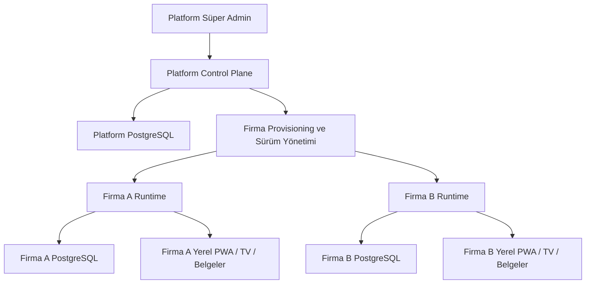

# TilbeCore – Kurban Takip
## Birleşik Ana Mimari, Gelişmiş Dizin Yapısı ve Düzeltilmiş Yol Haritası

**Belge tarihi:** 10 Ağustos 2026
**Belge durumu:** Bağlayıcı ana mimari ve yol haritası
**Ürün adı:** TilbeCore – Kurban Takip
**Kısa ad:** TilbeCore Kurban
**Teknik kod adı:** `tilbecore-kurban`

---

## 1. Belgenin amacı

Bu belge, Tilbe Kurban/Kurban 2026 hakkında erişilebilen önceki görüşmelerdeki iş kurallarını, ürün vizyonunu, teknik denetimleri, ana yol haritasını, Faz 1 ilerleme raporunu ve daha sonra kesinleşen çok firma/Süper Admin kararını tek kaynakta birleştirir.

Amaç:

- eski ve yeni kararlar arasındaki çelişkileri çözmek,
- programı yalnız 68 görüşme akışıyla veya mevcut ekran sayısıyla sınırlamamak,
- çok firma mimarisini sonradan eklenen bir özellik olmaktan çıkarıp çekirdeğe yerleştirmek,
- mevcut çalışan uygulamayı çöpe atmadan kontrollü yeniden yapılandırmak,
- gelişmiş fakat uygulanabilir bir depo/dizin yapısı belirlemek,
- fazların sırasını veri, finans, güvenlik ve saha gerçeklerine göre düzeltmek,
- her faz için ölçülebilir çıkış şartları tanımlamak.

Bu belge yazılırken erişilebilen kayıtlar arasında eski ürün/tasarım briefi, 7 Ağustos 2026 ana analiz ve yol haritası, aynı günkü salt-okunur teknik denetim, Faz 1 kapanış raporu ve sonraki çok firma/Süper Admin kararları karşılaştırılmıştır.

> Önceki konuşmada önerildiği anlaşılan gelişmiş kaynak kod dizininin birebir metni erişilebilir kayıtlarda bulunamadı. Bu belgede verilen hedef dizin, doğrulanmış kararlar ve mevcut depo yapısı esas alınarak yeniden tasarlanmış bağlayıcı hedef yapıdır; eski metin bulunmuş gibi sunulmamaktadır.

---

## 2. Karar önceliği ve değişiklik kuralı

Çelişkili iki kayıt bulunduğunda aşağıdaki sıra uygulanır:

1. Kullanıcının daha sonra açıkça kabul ettiği karar.
2. Tarihli ve sürümlü ana mimari/karar belgesi.
3. Doğrulanmış kaynak kod ve test kanıtı.
4. Eski tasarım briefi veya fikir listesi.
5. Yardımcı öneri ve varsayım.

Yeni karar eski kararı tamamen silmez. Karar günlüğünde:

- eski karar,
- yeni karar,
- değişiklik tarihi,
- değişiklik gerekçesi,
- etkilenen fazlar ve modüller

birlikte tutulur.

### 2.1 Kesinleştirilen ana çelişkiler

| Konu | Eski kayıt | Son ve bağlayıcı karar |
|---|---|---|
| Çok firma | Çok kiracılı SaaS daha sonraya bırakılabilir | Çok firma temeli ilk çekirdekten itibaren zorunlu |
| Veritabanı | Tek SQLite/tek işletme | Tek kod tabanı, platform DB ve firma başına ayrı PostgreSQL |
| Yönetim | Yalnız firma içi admin | Ayrı Platform Süper Admin ve ayrı Firma Admin paneli |
| SaaS | Genel ürünleştirme tamamen gelecek | Veri izolasyonu/provisioning şimdi; pazarlama, self-service abonelik ve otomatik faturalama sonra |
| Şube | Şube sayfaları eski tasarımda vardı | İlk canlıda firma başına tek lokasyon yeterli; `Location` temeli korunur, gelişmiş çok şube sonra |
| Hayvan türü | Eski brief küçükbaş sayfaları öneriyordu | Sistem yalnız büyükbaş kurban içindir |
| TV ekranı | Müşteri adı gösterebilen tasarım vardı | TV’de kişisel veri gösterilmez; kurban no ve durum gösterilir |
| Müşteri portalı | Finans/dekont gösterebilen genel portal fikri vardı | İlk canlı public takip yalnız tokenlı operasyon durumudur; PII/finans yoktur |
| Offline | Genel “offline-first” hedefi vardı | Kritik finans, satış, kesim onayı ve teslim yazıları sessizce çevrimdışı tamamlanmaz |
| Yazıcı | A5/termal fikirleri vardı | İlk canlı yalnız A4; gerekirse A4’e iki A5 yerleşimi |
| Sayfa sayısı | Yaklaşık 100 sayfa hedefi vardı | İşlevsiz sayfa üretilmez; tamamlanmayan modül menüde gösterilmez |
| Personel | Gelişmiş İK/vardiya fikirleri vardı | 40–50 saha personelinden yalnız yaklaşık 4–5 yetkili sistem kullanıcısı; ileri İK sonra |
| WhatsApp/SMS | Otomatik gönderim ana özellik gibi tasarlanmıştı | İlk canlıda bağlantı/şablon olabilir; otomatik gönderim ve dış servis entegrasyonu sonraya bırakılır |

---

## 3. Ürün ve kapsam kararı

TilbeCore Kurban, bir çiftliğin kurban operasyonunu baştan sona yöneten ve aynı kod tabanıyla birden fazla bağımsız firmaya sunulabilen bir platformdur.

Ana başarı cümlesi:

> Bir hayvanın satın alınmasından her hissenin gerçek paketinin teslimine kadar oluşan kimlik, fiyat, borç, tahsilat, vekâlet, sıra, tartım, paket ve teslim olayları kaybolmadan ve iki kez uygulanmadan izlenir; müşteri, cari, kasa, banka/POS ve rapor bakiyeleri aynı kaynaktan ve sıfır farkla üretilir.

### 3.1 İlk canlı sürümde zorunlu

- Çok firma veri izolasyon temeli
- Platform Süper Admin
- Firma oluşturma ve firma veritabanı provisioning
- Firma Admin ve firma kullanıcı/rol sistemi
- Sezon ve firma ayarları
- Müşteri ve sezon carisi
- Tedarikçi, alış faturası ve gider
- Büyükbaş hayvan, küpe, tartım, sağlık/uygunluk ve kurban numarası
- Hisse kartı ve hayvan başına tam yedi hisse
- Satış, fiyat kilidi, indirim, kapora, iptal ve transfer
- Tahsilat, karma ödeme, kasa, banka/POS ve iç ledger
- Vekâlet, A4 belge ve iki aşamalı QR
- Kesim sıra/durum motoru
- Gerçek hisse/paket tartımı ve kilo eksiği düzeltmesi
- Çiftlikten/adrese teslim ve tek seferlik QR kapanışı
- Masaüstü firma paneli
- Role özel mobil saha PWA
- Anonim TV ve tokenlı müşteri takip ekranı
- Temel raporlar ve audit
- Firma bazlı yedek, geri yükleme ve canlıya geçiş provası

### 3.2 İlk canlıdan sonra

- Self-service firma kaydı ve otomatik abonelik/faturalama
- Gelişmiş çok şube operasyonu
- Resmî WhatsApp Business API ile otomatik gönderim
- SMS/e-posta otomasyonu
- Termal yazıcı
- Gelişmiş araç rotası, GPS, sürücü fotoğrafı ve teslim kanıtı
- Özel parçalama tercihleri
- Ayrıntılı soğuk oda stoku
- Yem stok/reçete ve hayvan başı besi maliyeti
- İleri İK, vardiya, performans ve personel sohbeti
- Yapay zekâ tahmini, ROI ve özel rapor üreticisi
- Dış muhasebe, e-Fatura, banka/POS ve diğer API entegrasyonları

### 3.3 Kapsam dışı

- Küçükbaş kurban
- Adak ve akika
- Genel kasap/et satış ERP’si
- Finans kayıtlarını fiziksel silerek düzeltme
- Gerçek müşteri/veri dosyasını kaynak depoda tutma
- Gösteriş amacıyla placeholder sayfa doldurma
- İlk sürümde mikroservis karmaşıklığı

---

## 4. Platform mimarisi

Sistem tek kod tabanlı, kontrol düzlemi ile firma operasyon düzlemi ayrılmış, modüler monolit yaklaşımıyla geliştirilecektir.



### 4.1 Kontrol düzlemi

Platform veritabanında yalnız platform yönetimi için gerekli veriler tutulur:

- firma/tenant kimliği,
- firma adı ve teknik slug,
- kurulum/instance kaydı,
- lisans başlangıç ve bitişi,
- paket ve modül hakları,
- sürüm ve release channel,
- migration durumu,
- son sağlık sinyali,
- son yedek sonucu ve doğrulama zamanı,
- bakım/askıya alma durumu,
- platform kullanıcıları,
- support erişim kayıtları,
- platform audit olayları.

Platform veritabanında normal şartlarda şunlar bulunmaz:

- müşteri kartları,
- telefon/adres,
- tahsilat ve kasa hareketleri,
- vekâlet ses/görsel dosyaları,
- hisse ve kesim ayrıntıları,
- firma içi finans raporları.

### 4.2 Firma operasyon düzlemi

Her firma için ayrı PostgreSQL veritabanı bulunur. Firma operasyon verisi başka firmanın tablosuyla aynı fiziksel şemada `tenantId` filtresine güvenerek tutulmaz.

Her firma veritabanı şunları taşır:

- firma profili ve lokasyon,
- sezonlar,
- firma kullanıcıları, roller, izinler, cihaz ve oturumlar,
- müşteriler ve sezon hesapları,
- tedarikçiler ve alış faturaları,
- hayvanlar ve sağlık/tartım olayları,
- hisse kartları, hisseler, satış ve rezervasyonlar,
- ledger, tahsilat, kasa, banka/POS, iade ve gider,
- vekâletler, belgeler ve QR olayları,
- kesim, sıra, tartım, paket ve teslimat,
- firma audit/outbox kayıtları,
- firma dosya metadata’sı.

### 4.3 Süper Admin yetkisi

Süper Admin:

- firma açar/kapatır,
- firma adminini oluşturur,
- lisans ve modül haklarını yönetir,
- provisioning başlatır,
- sürüm ve migration durumunu görür,
- sağlık/yedek/kapasite bilgisini izler,
- bakım ve askıya alma işlemlerini yönetir.

Süper Adminin firma operasyon verisine normal erişimi yoktur. Destek erişimi gerekiyorsa:

- süreli,
- gerekçeli,
- firma onaylı veya politika ile açıkça yetkilendirilmiş,
- yalnız gerekli kapsamda,
- geri alınabilir,
- platform ve firma audit’ine birlikte yazılan

bir `SupportSession` üzerinden yapılır.

### 4.4 Firma Admin yetkisi

Firma Admin yalnız kendi firmasını yönetir:

- firma ayarları,
- sezon,
- kullanıcı ve roller,
- operasyon modülleri,
- finans/kasa,
- belgeler,
- firma raporları,
- firma yedek ve geri yükleme talepleri.

Bir firma kullanıcısının başka firma bağlantısını, veritabanı kimliğini veya verisini seçebilmesi mümkün değildir.

### 4.5 Çalıştırma biçimleri

Mimari iki dağıtım biçimini destekleyebilir:

1. **Yönetilen merkezi kurulum:** Platform ve firma runtime’ları yönetilen altyapıda çalışır; firma veritabanları yine ayrıdır.
2. **Yerel/hibrit kurulum:** Firma runtime’ı, PostgreSQL’i ve belge deposu firmanın yerel ağında çalışır; platform yalnız lisans, sürüm ve sağlık metadata’sını yönetir.

Bayram günü kritik saha operasyonunda yerel runtime ve yerel ağ birincildir. İnternet kesintisi platform kontrol düzlemini etkileyebilir fakat firmanın aktif sezon operasyonunu durdurmamalıdır. Kritik firma yazıları, firma PostgreSQL’ine ulaşmadan başarı sayılmaz.

### 4.6 Profesyonel domain, URL ve origin standardı

Production ana domain `tilbecore.com` olarak kesinleşmiştir. Kullanıcı `tilbecore.com` alan adını satın almış ve domain kayıt panelinde aktif olduğunu doğrulamıştır. Bu nedenle production ana domain kararı taslak değildir; bağlayıcı production değeri `BASE_DOMAIN=tilbecore.com` olarak kabul edilir. Domain ve host çözümleme kararı `docs/adr/ADR-0001-PROFESYONEL-SAAS-DOMAIN-URL-ORIGIN-VE-TENANT-HOST-STANDARDI.md` içinde bağlayıcı ADR olarak tutulur.

Kullanıcıya açık URL standardı:

- Ürün/tanıtım: `https://tilbecore.com`
- Platform Süper Admin: `https://console.tilbecore.com`
- Firma ana origin: `https://{tenantSlug}.tilbecore.com`
- Firma girişi: `https://{tenantSlug}.tilbecore.com/giris`
- Firma yönetim paneli: `https://{tenantSlug}.tilbecore.com/panel`
- Saha PWA: `https://{tenantSlug}.tilbecore.com/saha`
- TV ekranı: `https://{tenantSlug}.tilbecore.com/tv`
- Müşteri takip: `https://{tenantSlug}.tilbecore.com/takip/{opaqueToken}`
- QR çözümleme: `https://{tenantSlug}.tilbecore.com/q/{opaqueToken}`
- Kullanıcı daveti: `https://{tenantSlug}.tilbecore.com/davet/{opaqueToken}`
- Firma API: `https://{tenantSlug}.tilbecore.com/api/v1`
- Sistem durumu: `https://status.tilbecore.com`
- Yardım merkezi: `https://help.tilbecore.com`
- Güncellemeler: `https://updates.tilbecore.com`
- Hassas olmayan statik varlıklar: `https://assets.tilbecore.com`

Staging `staging.tilbecore.com`, local development `tilbecore.test` temel domainini kullanır. Domain değeri kodun farklı yerlerine dağıtılmaz; merkezi tipli `packages/config` sözleşmesi üzerinden kullanılır. Kullanıcıya gösterilen URL’lerde uygulama portu bulunmaz; iç portlar reverse proxy/gateway arkasında kalır. `api.tilbecore.com/v1` ve `hooks.tilbecore.com/v1` yalnız gelecek entegrasyon sözleşmesidir; bu pakette API, webhook, DNS, nameserver, SSL/TLS veya deployment kurulmaz.

Tenant çözümleme host normalize, port ayrıştırma, allowlist/pattern, platform/tenant host ayrımı, tenant slug validasyonu, platform registry çözümlemesi, aktif tenant kontrolü ve değişmez request tenant context sırasını izler. Platform ve tenant session/cookie alanları ayrıdır; cookie sözleşmesi host-only, Secure, HttpOnly, ortam bazlı farklı isim ve ayrı namespace kullanır.

---

## 5. Veri ve işlem mimarisi

### 5.1 Değişmez ilkeler

- Para `Decimal/Numeric(14,2)` veya kuruş bazlı güvenli tam sayı ile tutulur; `Float` kullanılmaz.
- Kilo `Numeric(10,3)` gibi sabit hassasiyetli tiptir.
- Sezon bütün firma operasyon ve finans kayıtlarında zorunludur.
- Küpe numarası global işletme kaydında değişmez kimliktir.
- Kurban numarası ile değişebilen operasyon sırası ayrı alanlardır.
- Kritik kayıt fiziksel silinmez; iptal, arşiv ve ters kayıt kullanılır.
- Fiyat, oran ve tarife işlem anında snapshot olarak kilitlenir.
- Kritik nesnelerde optimistic concurrency/version alanı bulunur.
- Aynı komut ağ sorunu veya çift tıklamayla iki kez uygulanmaz; idempotency kullanılır.
- Aynı hisse/numara/paket iki kullanıcıya aynı anda verilemez; veritabanı kısıtı ve transaction birlikte kullanılır.
- Her kritik komut atomik olarak iş verisini, finans etkisini, audit’i ve outbox olayını üretir.

### 5.2 Tek doğru finans kaynağı

Müşteri bakiyesi, farklı ekranlardaki `hisse fiyatı - ödeme` sorgularından hesaplanmaz. Tek doğru kaynak çift taraflı iç defterdir:

- `JournalEntry`
- `JournalLine`
- `Receipt`
- `ReceiptMethodSplit`
- `PaymentAllocation`
- `Refund`
- `Adjustment`

Cari, kasa, banka/POS ve raporlar aynı defterden türetilir. Bir muhasebe fişinde borç toplamı alacak toplamına eşit değilse işlem tamamlanamaz.

### 5.3 İşlem sınırı

Örnek kesin satış + kapora komutu aynı transaction içinde:

1. Firma/sezon/yetki doğrular.
2. Hissenin version ve müsaitlik durumunu kilitler.
3. Fiyat snapshot’ını oluşturur.
4. Satışı ve müşteri alacağını oluşturur.
5. Varsa tek tahsilat ve yöntem parçalarını oluşturur.
6. Borç dağıtımını yapar.
7. Kasa/banka/POS ledger hareketini oluşturur.
8. Audit ve outbox olayını yazar.
9. Hepsi başarılıysa commit eder.

Bir adım başarısızsa hiçbir parça kalıcı olmaz.

---

## 6. Bağlayıcı işletme kuralları

### 6.1 Müşteri ve sezon

- Her gerçek hissedar ayrı müşteri kartıdır.
- Zorunlu alanlar ad, soyad ve telefondur; adres isteğe bağlıdır.
- Aynı telefon aile üyelerinde kullanılabilir; otomatik birleştirme yapılmaz.
- Telefon güçlü, ad-soyad daha zayıf mükerrer uyarısıdır.
- Kullanıcı “mevcut kartı aç” veya “farklı kişi oluştur” seçer.
- Müşteri kalıcıdır; cari ve işlemler sezon bazında ayrılır.
- Eski sezon kilitlenir; yeni sezona sessizce bakiye taşımaz.

### 6.2 Hayvan ve tedarik

- Yalnız büyükbaş desteklenir.
- Hayvan tek tek veya toplu alış faturasıyla oluşturulabilir.
- Her hayvanın benzersiz küpesi ve ayrı gerçek alış bedeli vardır.
- Alış fiyatı kilogramdan otomatik türetilmez.
- Fatura tedarikçi borcu doğurur.
- Nakliye/veteriner gibi fatura giderleri merkezi giderde tek kayıt görünür; çift yazılmaz.
- Hayvan uygun, gözlem/tedavi veya uygunsuz olabilir.
- Uygunsuz hayvanda boş hisseler pasifleşir; satılmış hisse sessizce taşınmaz.

### 6.3 Hisse kartı ve satış

- Her hayvan tam yedi hisseye ayrılır.
- Bir hisse en fazla bir aktif satışa bağlıdır.
- Hisse kartı hayvandan bağımsız, sürümlü tarife tanımıdır.
- 30–35, 35–40, 40–45 ve 45–50 kg ifadeleri vaat sınıfıdır; gerçek teslim kilosu değildir.
- Liste fiyatı, indirim, net anlaşma bedeli, tahsilat ve kalan ayrı tutulur.
- Müşteri kabul ettiğinde ödeme olmasa da satış ve alacak oluşur.
- Herhangi bir pozitif tutar kapora sayılabilir.
- Kapora son tarihine kadar kapora yoksa satış ters kayıtla iptal edilir ve hisse açılır.
- Kaporalı/tamamlanmış satışın iptalini yönetici yapar; kesinti yoktur, tahsilat iade/mahsup edilir.
- Transfer fiyat farkını cariye işler; eski sahiplik ve fiyat geçmişi korunur.
- Yedinci hisse satılmazsa kesimden önce işletme sahibi/aileden gerçek kişi kurban niyeti ve vekâletiyle kaydedilir; sahte ticari gelir oluşturulmaz.

### 6.4 Tahsilat ve kasa

- Tek tahsilat nakit, banka/havale ve POS parçalarından oluşabilir.
- Ödeyen kişi ile hissedar farklı olabilir.
- Tek tahsilat birden çok müşteri/hisse borcuna dağıtılabilir.
- Dağıtım eşit, öncelikli veya manuel olabilir.
- Vade farkı yalnız POS anaparasına uygulanır.
- İade ve yanlış işlem düzeltmesi bağlantılı ters kayıt üretir.
- Günlük kasa fiziksel sayımla kapatılır; fark gizlenmez.

### 6.5 Vekâlet ve belge

- Her hisse için ayrı vekâlet durumu vardır.
- Yüz yüze sözlü, telefon ve WhatsApp ses kaydı yöntemleri desteklenir.
- Vekâlet veren ile hissedar ayrı kişiler olabilir.
- Tek kanıt birden fazla hisse vekâletine bağlanabilir.
- Kesim başlamadan önce yedi geçerli vekâlet zorunludur.
- Her hisseye ayrı sürümlü A4 kesim/teslim belgesi ve QR verilir.
- İlk QR kesim alanı kontrolü, ikinci QR tek seferlik teslim içindir.
- Kayıp belgede eski token iptal edilir, yeni sürüm üretilir.
- Borçlu belge istisnası gerekçeli yetkili onayı ve audit ister.

### 6.6 Kesim, tartım, paketleme ve teslim

- Operasyon aşamaları merkezi durum makinesiyle ilerler; doğrudan durum atlanmaz.
- Sıra değişikliği kurban numarasını değiştirmez ve gerekçeli kaydedilir.
- Her hisse gerçek baskülle ayrı tartılır.
- Kemikli, kemiksiz, ciğer/sakatat ve değerli parçalar mümkün olduğunca eşit dağıtılır.
- Alt paketler ayrı, bütün hisse tek dış paket altında izlenir.
- Gerçek teslim vaat üstündeyse tamamı verilir, ek ücret alınmaz.
- Altındaysa düzeltme: `net anlaşma bedeli ÷ vaat alt sınırı × eksik kg`.
- Çiftlikten ve adrese teslim desteklenir.
- Her hisse tek sefer teslim edilir.
- Hayvan ancak yedi hissenin tamamı teslim edilince kapanır.

---

## 7. Uygulama yüzeyleri

| Uygulama | Kullanıcı | Sorumluluk |
|---|---|---|
| Platform Admin | Süper Admin/ürün sahibi | Firma, lisans, modül, provisioning, sürüm, sağlık, yedek metadata’sı |
| Firma Web | Firma yöneticisi ve muhasebe | Yönetim, satış, finans, düzeltme, rapor, ayar |
| Saha PWA | Saha/kesim/tartım/teslim görevlileri | Role özel hızlı görevler ve QR |
| TV Ekranı | Müşteri/personel ortak görünüm | Anonim kurban no ve operasyon durumu |
| Müşteri Takip | Token sahibi müşteri | PII/finans içermeyen kendi operasyon durumu |
| Worker | Sistem | Son tarih, outbox, belge, yedek ve bakım işleri |
| Migration/Provisioning CLI | Platform operatörü | Firma DB oluşturma, migration, doğrulama ve geri alma |

Mobil PWA masaüstünün küçültülmüş hâli değildir. Role göre dört temel görev, sabit QR tarama, 48–56 px dokunma alanı, bağlantı durumu ve minimum veri girişi kullanır.

---

## 7.1 Profesyonel panel ve işletim kapsamı

10 Ağustos 2026 sonrası kullanıcı tarafından onaylanan profesyonel panel, ürün ve operasyon gereksinimleri, mevcut 68 iş akışının yerine geçmez ve `REQ-001..REQ-068` sayısını değiştirmez. Bu kapsam `PRO-001..PRO-036` kimlikleriyle `11-GEREKSINIM-IZLENEBILIRLIK-MATRISI.md` içinde ayrı takip edilir.

Firma/kullanıcı paneli aşağıdaki işletim yüzeyleriyle genişletilir:

- Operasyon Kontrol Merkezi ve istisna kuyruğu.
- Merkezi Onay Kutusu.
- Excel/CSV Veri İçe Aktarma Merkezi.
- Veri Kalitesi ve mükerrer kayıt merkezi.
- Evrensel müşteri/telefon/küpe/kurban/hisse/QR araması.
- Günlük görev ve vardiya devir teslimi.
- Bildirim gönderim/başarısızlık geçmişi.
- Cihaz, oturum ve giriş güvenliği yönetimi.
- KVKK, iletişim izni, veri dışa aktarma ve saklama süreci.
- Kullanıcı eğitim, yardım ve sentetik demo modu.
- WCAG 2.2 AA erişilebilirlik hedefi.

Ek planlı ürün/operasyon kapsamı:

- Sezon durum makinesi: hazırlık → satış → kesim → teslimat → mutabakat → arşiv.
- Sezon öncesi uçtan uca prova/simülasyon ortamı; gerçek firma, müşteri ve finans verisini etkilemez.
- Otomatik operasyonel tutarlılık denetimleri; 7 hisse, mükerrer satış, eksik vekâlet, ödeme/kasa farkı, teslim edilmeyen paket ve kapanış kontrollerini istisna kuyruğuna bağlar.
- Güvenli çevrimdışı işlem kuyruğu; izinli işlemleri idempotent senkronize eder, kritik finans/satış/kesim/teslim yazılarını sessiz tamamlanmış saymaz.
- Acil durum / yalnızca okuma modu; arıza veya bakım sırasında güvenli görüntüleme, listeleme, çıktı ve operasyon devamlılığı sağlar.
- Donanım adaptör katmanı; terazi, barkod/QR okuyucu, etiket yazıcısı, termal yazıcı ve TV cihazlarını domain kodundan ayırır.
- Güvenli entegrasyon merkezi; SMS, e-posta, ödeme ve muhasebe entegrasyonlarında webhook, outbox, retry, imza doğrulama ve idempotency standardını uygular.

Platform Süper Admin kapsamı mevcut Platform Control Plane kararlarını aşağıdaki işletim yüzeyleriyle genişletir:

- Firma kurulum/provisioning sihirbazı.
- Platform güvenlik merkezi ve MFA/passkey politikası.
- Güncelleme ve migration ön kontrolü.
- Firma/modül bazlı acil durdurma anahtarı.
- Olay, kesinti ve bakım yönetimi.
- Kapasite, depolama, kullanıcı ve cihaz görünümü.
- Firma yapılandırma ve sürüm karşılaştırması.
- Firma veri dışa aktarma, kapatma ve devir süreci.
- Destek talebini `SupportSession` ile ilişkilendirme.
- Yedekten dönüş provası ve doğrulama kanıtı.

Bu başlıklar Faz 2A'ya yığılmaz. Bağımlı oldukları platform, firma, finans, operasyon, test, güvenlik ve canlıya hazırlık fazlarına dağıtılır.

Bağlayıcı ürün ilkeleri:

- Yapay zekâ ilk aşamada yalnız öneri, özet ve anormallik tespiti yapar; ödeme, iptal, teslimat, yetki veya finansal işlem gerçekleştirmez.
- Placeholder/yakında sayfaları tamamlanmış modül kabul edilmez; menüde veya raporda “tamamlandı” gibi sunulamaz.
- Her yeni gereksinimin sahibi, kabul kriteri, test kanıtı, planlanan fazı ve geri dönüş yöntemi bulunur.
- İlk canlı sezon öncesinde uçtan uca Kurban Günü Provası zorunlu kabul kapısıdır; gerçek üretim verisini etkilemeyen kanıtlı prova olmadan canlıya hazır denmez.

## 7.2 Teknoloji ve kalite standartları

Bu standartlar yeni mikroservis, Kubernetes, blockchain, tam event-sourcing, native mobil veya zorunlu yapay zekâ kararı değildir. Mevcut modüler monolit ve tek kod tabanı kararını güçlendirir.

- OpenTelemetry tabanlı trace, metric ve log korelasyonu hedeflenir; PII/secret loglanmaz, requestId ve auditId ilişkilendirilebilir olur.
- Playwright ile masaüstü, mobil, locale ve RTL E2E testleri koşulur.
- axe tabanlı otomatik erişilebilirlik kontrolleri ve WCAG 2.2 AA kabul kriterleri test planına alınır.
- Platform yöneticileri için WebAuthn/passkey ve MFA hedeflenir.
- OWASP ASVS Level 2 güvenlik hedefi kimlik, oturum, yetki, dosya, hata, logging, tenant isolation ve destek erişimi başlıklarında kabul ölçütü olur.
- OpenFeature uyumlu feature flag sözleşmesi hedeflenir.
- Yönetilen PostgreSQL kurulumlarında WAL/PITR kabiliyeti değerlendirilir; yerel/hibrit kurulumlarda eşdeğer yedek/restore kanıtı aranır.

---

## 8. Gelişmiş hedef dizin yapısı

Hedef depo bir `pnpm workspace` monorepo olacaktır. İlk sürümde mikroservis kullanılmaz; uygulamalar ve domain paketleri aynı depoda, açık bağımlılık kurallarıyla tutulur.

```text
tilbecore-kurban/
├── apps/
│   ├── platform-admin/              # Süper Admin web uygulaması
│   │   ├── app/
│   │   ├── features/
│   │   ├── server/
│   │   └── tests/
│   ├── tenant-web/                  # Firma masaüstü yönetim paneli
│   │   ├── app/
│   │   │   ├── (auth)/
│   │   │   ├── (dashboard)/
│   │   │   └── api/
│   │   ├── features/
│   │   ├── server/
│   │   └── tests/
│   ├── field-pwa/                   # Saha, kesim, tartım ve teslim PWA
│   │   ├── app/
│   │   ├── features/
│   │   ├── offline/
│   │   └── tests/
│   ├── public-display/              # TV ve tokenlı müşteri takip
│   │   ├── app/
│   │   ├── server/
│   │   └── tests/
│   ├── worker/                      # Outbox, son tarih, belge, yedek işleri
│   │   ├── jobs/
│   │   ├── schedulers/
│   │   └── tests/
│   └── provisioning-cli/            # Firma DB/migration/restore komutları
│       ├── commands/
│       └── tests/
├── packages/
│   ├── platform/
│   │   ├── domain/                  # Organization, license, plan, instance
│   │   ├── application/
│   │   ├── infrastructure/
│   │   └── contracts/
│   ├── tenancy/                     # Tenant çözümleme ve güvenli DB yönlendirme
│   ├── tenant-kernel/               # Firma bağlamı, sezon, komut altyapısı
│   ├── auth/                        # Oturum, rol, izin ve policy
│   ├── audit/                       # Platform ve firma audit sözleşmeleri
│   ├── idempotency/                 # Tekrarlı komut koruması
│   ├── outbox/                      # Güvenli olay yayınlama
│   ├── storage/                     # Korumalı belge deposu
│   ├── database-platform/           # Platform Prisma şeması/migration
│   ├── database-tenant/             # Firma Prisma şeması/migration
│   ├── contracts/                   # API/event DTO ve sürümleme
│   ├── api-kit/                     # Hata, requestId, validation, response
│   ├── i18n/                        # Mesaj katalogları, locale ve RTL
│   ├── observability/               # Log, metric, health, trace
│   ├── security/                    # CSRF, rate limit, redaction, policy
│   ├── ui/                          # Ortak erişilebilir tasarım sistemi
│   ├── printing/                    # A4/A5 belge ve etiket altyapısı
│   ├── config/                      # Tipli ortam ve feature flag ayarları
│   └── testing/                     # Test builder, fixture ve helper’lar
├── domains/
│   ├── seasons/
│   ├── customers/
│   ├── suppliers/
│   ├── purchasing/
│   ├── expenses/
│   ├── animals/
│   ├── share-cards/
│   ├── share-sales/
│   ├── finance-ledger/
│   ├── cash-management/
│   ├── proxy-grants/
│   ├── documents/
│   ├── slaughter-operations/
│   ├── weighing/
│   ├── packaging/
│   ├── deliveries/
│   ├── notifications/
│   ├── reporting/
│   └── system-continuity/
├── infrastructure/
│   ├── docker/
│   ├── reverse-proxy/
│   ├── postgres/
│   ├── backups/
│   ├── monitoring/
│   ├── local-install/
│   └── managed-cloud/
├── tests/
│   ├── architecture/
│   ├── contracts/
│   ├── integration-platform/
│   ├── integration-tenant/
│   ├── tenant-isolation/
│   ├── e2e-platform/
│   ├── e2e-tenant/
│   ├── e2e-field/
│   ├── load/
│   ├── resilience/
│   ├── restore/
│   └── printing/
├── docs/
│   ├── architecture/
│   ├── adr/
│   ├── requirements/
│   ├── workflows/
│   ├── security/
│   ├── operations/
│   ├── runbooks/
│   ├── testing/
│   └── user-guides/
├── scripts/
│   ├── quality/
│   ├── migrations/
│   ├── backups/
│   ├── imports/
│   └── releases/
├── pnpm-workspace.yaml
├── turbo.json
├── package.json
├── tsconfig.base.json
└── AGENTS.md
```

### 8.1 Domain paket standardı

Her domain aşağıdaki sorumluluk ayrımını izler:

```text
domains/share-sales/
├── src/
│   ├── domain/
│   │   ├── entities/
│   │   ├── value-objects/
│   │   ├── policies/
│   │   ├── events/
│   │   └── errors/
│   ├── application/
│   │   ├── commands/
│   │   ├── queries/
│   │   ├── services/
│   │   └── ports/
│   ├── infrastructure/
│   │   ├── repositories/
│   │   ├── mappers/
│   │   └── adapters/
│   ├── presentation/
│   │   ├── api/
│   │   ├── components/
│   │   └── schemas/
│   ├── contracts/
│   └── index.ts
├── tests/
│   ├── unit/
│   ├── integration/
│   ├── authorization/
│   ├── concurrency/
│   └── regression/
├── README.md
└── package.json
```

### 8.2 Bağımlılık kuralları

- `domain` hiçbir UI, Next.js, Prisma veya dış servis paketi import etmez.
- `application` domain’i ve portları kullanır; Prisma’ya doğrudan erişmez.
- `infrastructure` portları uygular.
- `presentation` yalnız application komut/sorgularını çağırır.
- Bir domain başka domain’in veritabanı tablosuna doğrudan yazmaz.
- Domainler arası işlem tanımlı komut, port veya sürümlü event contract ile yürür.
- `apps/*` içinde iş kuralı yazılmaz.
- Ortak paketlere işletme modülüne özel rastgele helper taşınmaz.
- Döngüsel paket bağımlılığı mimari testle engellenir.
- Platform paketi tenant operasyon domainlerini doğrudan okuyamaz.

### 8.3 Mevcut depodan geçiş

Mevcut `app`, `components`, `modules`, `shared`, `prisma` yapısı tek seferde taşınmaz.

Geçiş sırası:

1. Mimari bağımlılık envanteri ve import grafiği çıkarılır.
2. Workspace ve boş hedef paketler davranış değiştirmeden oluşturulur.
3. Mevcut uygulama geçici olarak `apps/tenant-web` rolünü sürdürür.
4. Önce ortak güvenlik/API/i18n/test paketleri ayrılır.
5. Sonra yeni geliştirilen domainler hedef yapıda doğar.
6. Eski modüller testlerle ve küçük partiler hâlinde taşınır.
7. Her taşıma sonrası lint, typecheck, test, build ve smoke test çalışır.
8. Eski klasör yalnız bütün importlar ve davranış kanıtlandıktan sonra kaldırılır.

---

## 9. Platform ve tenant veritabanı sınırları

### 9.1 Platform şeması

Önerilen çekirdek modeller:

- `PlatformUser`
- `Organization`
- `OrganizationAdminInvite`
- `TenantInstance`
- `TenantDatabaseRef`
- `Plan`
- `Subscription`
- `FeatureEntitlement`
- `ReleaseChannel`
- `Deployment`
- `MigrationRun`
- `HealthHeartbeat`
- `BackupStatus`
- `SupportSession`
- `PlatformAuditEvent`

Bağlantı parolaları düz metin saklanmaz; secret store/şifreli yapı kullanılır. API yanıtı, log veya hata mesajında bağlantı bilgisi gösterilmez.

### 9.2 Firma şeması

Önerilen gruplar:

- Çekirdek: `BusinessProfile`, `Location`, `Season`, `Setting`
- Kimlik: `User`, `Role`, `Permission`, `UserSession`, `Device`
- Denetim: `AuditEvent`, `IdempotencyKey`, `JobOutbox`
- Müşteri: `Customer`, `CustomerPhone`, `CustomerAddress`, `CustomerSeasonAccount`
- Tedarik: `Supplier`, `SupplierAccount`, `PurchaseInvoice`, `PurchaseInvoiceLine`, `SupplierPayment`, `ExpenseDocument`
- Hayvan: `Animal`, `AnimalWeight`, `AnimalHealthEvent`, `QurbanAssignment`, `QueueNumberHistory`
- Hisse: `ShareCard`, `ShareCardVersion`, `AnimalShare`, `ShareStatusHistory`
- Satış: `ShareSale`, `ShareSaleLine`, `ReservationDeadline`, `Cancellation`, `TransferApproval`
- Finans: `FinancialAccount`, `JournalEntry`, `JournalLine`, `Receipt`, `ReceiptMethodSplit`, `PaymentAllocation`, `Refund`, `PosInstallmentPlan`
- Vekâlet/belge: `ProxyGrant`, `ProxyShareLink`, `Attachment`, `SlaughterDeliveryDocument`, `DocumentToken`, `DocumentScanEvent`
- Operasyon: `SlaughterRun`, `OperationQueueEntry`, `StageEvent`, `OverrideApproval`, `Incident`
- Tartım/paket: `WeighingSession`, `SharePackage`, `PackageItem`, `WeightCorrection`, `ShortfallAdjustment`
- Teslim: `DeliveryOrder`, `DeliveryShare`, `DeliveryEvent`, `Vehicle`, `RouteNote`
- Bildirim: `NotificationTemplate`, `Notification`, `Subscription`, `TrackingToken`

---

## 10. API, hata, i18n ve güvenlik standardı

Faz 1’de başlayan merkezi hata/i18n sistemi bütün gerçek API’lere kademeli uygulanır.

Standart hata gövdesi:

```json
{
  "hata": "Güvenli kullanıcı mesajı",
  "kod": "SHARE_NOT_AVAILABLE",
  "mesajAnahtari": "share.notAvailable",
  "parametreler": {},
  "requestId": "uuid"
}
```

Kurallar:

- Eski `hata` alanı kontrollü geçiş boyunca korunur.
- Ham stack, Prisma mesajı, SQL, dosya yolu, bağlantı bilgisi ve secret dönmez.
- `requestId` istemci ve log korelasyonu sağlar.
- Hata parametreleri log/header enjeksiyonuna karşı temizlenir.
- Teknik i18n key production’da kullanıcıya gösterilmez.
- Route’lar iş kuralı yazmaz; komut/query çağırır.
- Yetki yalnız UI’da buton gizlemek değildir; API/application policy’de zorunludur.
- Kritik yazılarda origin/CSRF, rate limit, idempotency ve audit uygulanır.
- Hassas dosyalar `public` altında değildir.
- Dosya erişimi kimlik, firma, sezon ve izin kontrolünden geçer.

---

## 11. Düzeltilmiş yol haritası

Mevcut numaralandırma korunur. Çok firma kararı Faz 2’nin zorunlu parçası hâline getirilir; sonraki iş fazlarının numarası değişmez.

### Faz 0 — Güvenli başlangıç ve çalışma disiplini

**Mevcut durum:** Kısmi/kanıt tamamlanmalı.

- Değişmez ana veri yedeği
- İki fiziksel kopya
- Gerçek geri yükleme testi
- `develop` ve özellik dalı politikası
- CI: install, UTF-8, lint, typecheck, unit/integration test, build
- Secrets ve hassas dosya taraması
- Gerçek veri ile test/demo verisinin ayrılması
- ADR ve karar günlüğü

**Çıkış:** Geri yükleme kanıtlı, CI yeşil, gerçek veri depodan ayrılmış.

### Faz 1 — P0 güvenlik ve teknik stabilizasyon

**Mevcut durum:** Tamamlandı ve `origin/main` dalına gönderildi.

**Kapanış commit’i:** `a6720378123f01fb4e19db3fd782a910f18c0acf`

Tamamlandığı bildirilenler:

- UTF-8 kontrolü
- Merkezi hata/i18n altyapısı
- Beş pilot API route
- Hata sızıntısı ve requestId testleri
- Ödemeli hisse iptal koruması
- Vekâlet route güvenlik testleri
- TypeScript, 102 test, lint 0 hata, build ve diff kontrolü
- Tam program envanteri

Faz 1 dışı bırakılıp sonraki fazlara taşınan riskler:

- finansal `Float` dönüşümü ve ledger modeli,
- platform/firma PostgreSQL ayrımı,
- tenant izolasyonu ve gerçek PostgreSQL integration testleri,
- tüm route ve ekranların merkezi hata/i18n dönüşümü,
- placeholder/yakında sayfalarının ürün kapsamından ayrıştırılması.

**Çıkış:** Mevcut uygulama para/veri kaybettiren açık davranış içermiyor ve bütün kalite kapıları yeşil.

### Faz 2 — Çok firma platform çekirdeği, gelişmiş dizin ve PostgreSQL

#### Faz 2A — Mimari sözleşme ve monorepo iskeleti

**Mevcut durum:** Kapanış paketiyle davranış değiştirmeyen sözleşme, dokümantasyon, import grafiği, taşıma matrisi ve test planı çıkış kriterleri karşılandı. `b536078` commit’i erken tamamlanan saha satış modüler pilotudur ve tek başına Faz 2A kapanışı değildir. `120afa16e8b635823a80b0967cbfe18e651bd2ad` sonrasında gerçek Faz 2A workspace/sözleşme/sınır paketi başlatılmıştır.

- Bu belgenin repo dokümanlarına işlenmesi
- `AGENTS.md`, gereksinim matrisi, risk/geri dönüş ve envanter uyumu
- mevcut kök dizinin tam tasnifi ve taşıma matrisi
- pnpm workspace ve hedef paket sınırları
- mimari bağımlılık testleri
- mevcut modüllerin taşıma matrisi
- platform/tenant contract’ları
- profesyonel domain/origin config sözleşmesi ve testleri
- platform–tenant veri sınırı ADR’si
- tenant izolasyon test planı

Faz 2A kapsamında davranış değiştirmeden üretilen import grafiği, domain/origin config paketi ve taşıma matrisi `15-FAZ-2A-IMPORT-GRAFIGI-VE-TASIMA-MATRISI.md` içinde tutulur.

Platform DB, PostgreSQL kurulumu, tenant routing, Süper Admin ekranı ve gerçek app taşıması Faz 2A işi değildir; Faz 2B, Faz 2C veya sonraki küçük taşıma paketlerinde uygulanır.

#### Faz 2B — Platform Control Plane ve Süper Admin MVP

**Mevcut durum:** Başladı — 2B-1 platform domain ve database-platform şema temeli uygulandı; 2B-1A ile public package import sınırı, workspace dependency manifestleri, generated platform Prisma tipleri, nested relation write sözleşmeleri, `TenantDatabaseRefRepository`, `validUntil` ve genel operasyonel limit ayrımı, `0002_platform_baseline_hardening` migration SQL'i ve boundary/schema/repository testleri eklendi. 2B-1B ile PostgreSQL 16 servisli CI kapısı, gerçek migration deploy ve gerçek Prisma repository integration testleri eklendi; bu kanıt GitHub Actions yeşil koşusuyla raporlandığında 2B-1B tamamlanmış sayılır. Süper Admin ekranı, platform login/session, provisioning ve tenant routing henüz tamamlanmadı.

- Platform PostgreSQL
- Organization/instance/lisans/paket/modül modelleri
- Platform kullanıcı ve yetkileri
- Platform güvenlik merkezi, MFA/passkey politikası ve cihaz/oturum görünümü
- Firma oluşturma ve admin daveti
- provisioning durum ekranı
- Firma kurulum/provisioning sihirbazı
- sürüm, migration, sağlık ve yedek metadata’sı
- firma/modül bazlı acil durdurma anahtarı
- olay, kesinti ve bakım yönetimi
- kapasite, depolama, kullanıcı ve cihaz görünümü
- firma yapılandırma ve sürüm karşılaştırması
- firma veri dışa aktarma, kapatma ve devir süreci
- support session ve platform audit
- destek talebi ile `SupportSession` ilişkilendirme

#### Faz 2C — Firma başına ayrı PostgreSQL ve tenant yönlendirme

- Güvenli tenant resolution
- Firma DB connection registry
- Firma DB oluşturma
- Her firma için ayrı migration
- tenant isolation testleri
- firma bazlı yedek/geri yükleme
- yönetilen PostgreSQL kurulumlarında WAL/PITR değerlendirmesi
- bağlantı havuzu ve kapasite sınırları

#### Faz 2D — Firma çekirdek şeması

- Season, customer, supplier, animal, share card, sale ve ledger temeli
- Sezon durum makinesi sözleşmesi: hazırlık → satış → kesim → teslimat → mutabakat → arşiv
- Decimal para ve Numeric kilo
- command/service/repository katmanı
- authorization, audit, idempotency ve outbox
- eski SQLite → yeni tenant DB import iskeleti
- Excel/CSV içe aktarma dry-run ve veri kalitesi sözleşmesi

**Çıkış:** İki test firması oluşturulur; ayrı DB’lerde aynı kimlikler bulunabilse bile veri sızıntısı olmaz; migration, backup/restore ve tenant isolation testleri geçer.

### Faz 3 — Müşteri, sezon ve cari kart

- Kalıcı müşteri ve sezon hesapları
- Mükerrer uyarısı ve normalize arama
- Veri Kalitesi ve mükerrer kayıt merkezi
- Evrensel müşteri/telefon araması
- Müşteri 360° kartı
- Sezon ekstresi ve tüm sezonlar geçmişi
- Payer/beneficiary ayrımı
- Müşteri veri sürümü ve audit
- KVKK, iletişim izni, veri dışa aktarma ve saklama süreci temeli

**Çıkış:** Aynı müşteri iki sezonda ayrı ekstreye ve birleşik geçmişe sahiptir.

### Faz 4 — Tedarikçi, alış faturası, gider ve hayvan

- Tedarikçi carisi
- PDF ve toplu fatura satırları
- Excel/CSV içe aktarma şablonları ve satır bazlı hata raporu
- Faturadan hayvan oluşturma ve hayvandan faturaya bağlama
- Tekil küpe ve gerçek alış bedeli
- Evrensel küpe/kurban araması
- Tartım ve sağlık/uygunluk geçmişi
- Kurban no ve operasyon sıra geçmişi
- Gider bağlantısı ve çift kayıt engeli

**Çıkış:** 20 satırlı faturadan 20 tekil hayvan ve doğru tedarikçi borcu atomik/tutarlı oluşur.

### Faz 5 — Hisse kartı, rezervasyon ve atomik satış

- Hisse kartı ve fiyat sürümü
- Hayvana tam yedi hisse
- Otomatik tutarlılık denetimleri için 7 hisse, çifte satış ve satış kapanış kuralları
- Uygun hisse önerisi
- Evrensel hisse/QR araması
- Rezervasyon ve süre
- Liste/indirim/net fiyat snapshot’ı
- Satış + opsiyonel kapora tek transaction
- Kapora son tarihi ve otomatik ters kayıt
- İptal, transfer, sağlık kaynaklı taşıma
- İşletme sahibi yedinci hisse

**Çıkış:** Eşzamanlı iki satıştan yalnız biri başarılı olur; satış ve finans yarım kalmaz.

### Faz 6 — Ledger, tahsilat ve kasa

- Çift taraflı ledger
- Tek makbuz ve yöntem parçaları
- Çoklu borç dağıtımı
- Nakit/banka/POS hesapları
- Merkezi Onay Kutusu ile kritik finansal onaylar
- POS taksit ve vade farkı
- İndirim, iade, mahsup ve düzeltme
- Tedarikçi ödeme ve gider
- Günlük kasa açılış/kapanış
- Finansal mutabakat
- Kritik finansal işlem güvenliği; ödemeli hisse iptali, kasa kapatma ve toplu finans işlemlerinde yeniden doğrulama veya ikinci yetkili onayı

**Çıkış:** Cari, kasa, banka/POS ve raporlar sıfır farkla aynı ledger’a bağlanır.

### Faz 7 — Vekâlet, korumalı belge ve QR

- Çok yöntemli ve çok hisseli vekâlet
- Korumalı dosya deposu
- A4/iki A5 belge şablonu
- Belge token’ı ve sürümü
- Kayıp belge iptal/yenileme
- Kesim ve teslim tarama olayları
- Borç override onayı

**Çıkış:** Eski/kopya belge ikinci kesim veya teslim işlemi yaptıramaz.

### Faz 8 — Kesim operasyon motoru

- Kontrollü aşama makinesi
- Sıra havuzu ve geçmişi
- Operasyon Kontrol Merkezi ve istisna kuyruğu
- Günlük görev ve vardiya devir teslimi
- Role özel saha/kesim ekranları
- Önkoşullar ve yönetici istisnası
- Geri alma/düzeltme olayları
- TV ve müşteri takip verisi

**Çıkış:** Eksik vekâlet veya uygunsuz hayvan normal yoldan kesime başlayamaz.

### Faz 9 — Tartım, paketleme ve kilo farkı

- Ürün/bileşen tartımı
- Terazi ve etiket yazıcı adapter sözleşmeleri
- Yedi hisseye miktar/değer dengesi
- Alt paket ve dış paket
- A4 etiket
- Paket/etiket sürümü ve düzeltme
- Alt sınır iade hesabı
- Teslime hazır kontrolü

**Çıkış:** Yedi hisse paket toplamları kaynak tartımlarla mutabıktır.

### Faz 10 — Teslimat, saha PWA, TV ve müşteri takip

- Çiftlikten ve adrese teslim
- Hazır/yüklendi/teslim edildi akışı
- Hisse bazlı tek kullanımlık QR teslim
- Role özel PWA
- Bağlantı kaybı ve yeniden bağlanma
- Güvenli çevrimdışı işlem kuyruğu ve çakışma yönetimi
- Acil durum / yalnızca okuma modu
- QR okuyucu, termal yazıcı ve TV cihaz adapterleri
- Anonim TV
- PII’siz tokenlı müşteri takip
- Cihaz, oturum ve giriş güvenliği yönetimi
- Bildirim gönderim ve başarısızlık geçmişi
- SMS, e-posta, ödeme ve muhasebe entegrasyonları için güvenli entegrasyon merkezi temeli

**Çıkış:** Her hisse yalnız bir kez kapanır; 5–20 cihaz testinde saha hızlı ve güvenlidir.

### Faz 11 — Raporlama ve firma yönetim paneli

- Yönetici dashboard
- Operasyon Kontrol Merkezi
- Satış, doluluk, fiyat ve indirim
- Cari, borç, tahsilat ve iade
- Kasa, banka/POS ve gider
- Tedarikçi ve alış
- Kesim süreleri ve darboğaz
- Eksik vekâlet/paket ve override
- Audit ve sezon karşılaştırması
- Evrensel arama, eğitim/yardım ve sentetik demo modu
- WCAG 2.2 AA erişilebilirlik kabulü

**Çıkış:** Bütün raporlar kaynak ledger ve operasyon olaylarıyla otomatik mutabıktır.

### Faz 12 — Sertleştirme, platform işletimi ve canlıya geçiş

- Platform ve firma UAT
- Gerçek uçtan uca kurban provası
- Sezon öncesi simülasyon ortamı ve zorunlu Kurban Günü Provası kabul kapısı
- İki firma ile izolasyon provası
- 5–20 cihaz yük testi
- Playwright masaüstü/mobil/locale/RTL E2E ve axe erişilebilirlik testleri
- OWASP ASVS Level 2 güvenlik hedefi doğrulaması
- OpenTelemetry trace/metric/log korelasyonu doğrulaması
- Ağ, elektrik ve sunucu kesintisi tatbikatı
- Firma bazlı backup/restore ve yedek cihaz devralma
- yedekten dönüş provası ve doğrulama kanıtı
- SQLite import provası
- Demo veri temizliği
- Kullanıcı eğitimleri ve acil durum talimatı
- Release channel ve sürüm dondurma
- Pilot firma/canary yayın, health check, bakım modu ve hızlı geri dönüş
- Canlıya alma ve geri dönüş planı

**Çıkış:** Platform operatörü ve firma personeli kendi uçtan uca senaryolarını hatasız tamamlar; firma verileri karışmaz ve yedekten dönüş kanıtlanır.

---

## 12. Her fazın zorunlu kalite kapısı

Bir faz yalnız kod yazıldığı için tamamlanmaz. Aşağıdaki kanıtlar gerekir:

- gereksinim ve kabul kriteri,
- veri/şema etkisi,
- migration ileri ve geri senaryosu,
- tenant isolation etkisi,
- rol/yetki kontrolü,
- normal, hata, iptal ve ters kayıt senaryosu,
- çift tıklama/idempotency,
- eşzamanlı kullanıcı testi,
- audit ve hata mesajı doğrulaması,
- unit ve integration testleri,
- ilgili E2E akışı,
- lint/typecheck/build,
- 360–430 px mobil ve masaüstü kontrolü,
- belge/QR varsa gerçek baskı testi,
- yedek/geri yükleme etkisi,
- dokümantasyon ve takip matrisi güncellemesi.

Finansal veya gerçek veri etkili migration:

1. Değişmez yedek alınmadan,
2. Geri yükleme kanıtlanmadan,
3. Maskeli/test kopyasında denenmeden,
4. Kayıt sayısı ve finans toplamı mutabakatı yapılmadan,
5. Geri dönüş planı hazırlanmadan

uygulanmaz.

---

## 13. Belge ve kaynak hiyerarşisi

Repo içindeki belgeler aşağıdaki görev ayrımını izlemelidir:

```text
docs/
├── architecture/
│   ├── 00-ANA-KARAR-KAYDI.md
│   ├── 01-SISTEM-BAGLAMI-VE-URUN-KAPSAMI.md
│   ├── 02-COK-FIRMA-VE-VERI-IZOLASYONU.md
│   ├── 03-PLATFORM-VE-FIRMA-VERITABANI.md
│   ├── 04-DOMAIN-VE-DIZIN-MIMARISI.md
│   ├── 05-FINANS-LEDGER-VE-TERS-KAYIT.md
│   ├── 06-GUVENLIK-YETKI-VE-DOSYA.md
│   ├── 07-PWA-TV-VE-MUSTERI-TAKIP.md
│   ├── 08-YEDEK-GERI-YUKLEME-VE-IMPORT.md
│   ├── 09-TEST-VE-KALITE-KAPILARI.md
│   ├── 10-I18N-RTL-VE-API-HATA.md
│   ├── 11-GEREKSINIM-IZLENEBILIRLIK-MATRISI.md
│   ├── 12-FAZLAR-RISKLER-VE-GERI-DONUS.md
│   └── 14-PROGRAM-TAM-KAPSAM-ENVANTERI.md
├── adr/
│   ├── ADR-0001-PROFESYONEL-SAAS-DOMAIN-URL-ORIGIN-VE-TENANT-HOST-STANDARDI.md
│   └── ADR-0002-PLATFORM-TENANT-VERI-SINIRI-VE-ERISIM-STANDARDI.md
├── requirements/
├── workflows/
└── runbooks/
```

`AGENTS.md` bütün ürün ayrıntılarını tekrar etmez. Yalnız çalışma disiplini, bağlayıcı belgeler, test/yedek/onay kuralları ve yasak işlemleri işaret eder.

`KURBAN2026-UYGULAMA-TAKIP.md` gerçekleşen işleri, commit/PR kanıtını, test sonucunu ve sonraki adımı tutar; mimari karar kaynağı değildir.

`14-PROGRAM-TAM-KAPSAM-ENVANTERI.md` yalnız görüşme gereksinimlerini değil gerçek kaynak kodun bütün sayfa, route, bileşen, model, script, altyapı ve placeholder alanlarını izler.

---

## 14. Şu anki gerçek konum ve sonraki doğru adım

10 Ağustos 2026 dokümantasyon uyumlandırması itibarıyla:

- Faz 1 tamamlandı ve `origin/main` dalına gönderildi,
- Faz 1 commit’i: `a6720378123f01fb4e19db3fd782a910f18c0acf`,
- Faz 2A workspace/sözleşme/sınır paketi kapanış kriterleri dokümantasyon ve sözleşme düzeyinde karşılandı; Platform DB, PostgreSQL, tenant routing ve gerçek app taşıması Faz 2B/2C veya sonraki taşıma paketlerine aittir,
- merkezi hata/i18n yalnız beş pilot route’ta,
- finansal `Float`, yeni ledger, PostgreSQL, tenant izolasyonu ve gerçek integration/E2E testleri henüz yapılmadı,
- 69 placeholder/yakında sayfası gerçek özellik kabul edilmiyor.

Doğru sıra:

1. Bu birleşik mimariyi ayrı dokümantasyon değişikliğiyle ana belgelere işle.
2. Eski “çok firma/SaaS sonra” cümlesini “çok firma izolasyon temeli şimdi; self-service ticari SaaS sonra” şeklinde düzelt.
3. Faz 2A’da önce mimari sözleşme, gelişmiş dizin/monorepo iskeleti ve taşıma planını davranış değiştirmeden kur.
4. Faz 2B/2C’de Platform DB, Süper Admin, provisioning ve firma başına ayrı PostgreSQL’i testlerle oluştur.
5. Ancak bundan sonra müşteri/finans gibi yeni çekirdek domain geliştirmesine geç.

Faz 2 başlamadan önce verilecek zorunlu kanıtlar:

- Faz 1 commit hash’i: `a6720378123f01fb4e19db3fd782a910f18c0acf`,
- Faz 2A için temiz veya bilinçli kapsamlandırılmış `git status`,
- yedek ve geri yükleme sonucu,
- CI sonucu,
- mevcut import grafiği,
- kök dizin tasnifi ve taşıma matrisi,
- yeni dizin taşıma matrisi,
- platform/tenant veri sınırı ADR’si,
- tenant isolation test planı.

### 14.1 Faz 2A uygulama sınıflandırması

- `b536078` commit’i erken tamamlanan saha satış modüler pilotudur.
- Bu pilot `/api/saha-satis` için route adaptörü, application/use-case ve domain kural ayrımını kanıtlar.
- Bu pilot Faz 2A’nın tamamlandığı anlamına gelmez.
- Gerçek Faz 2A workspace ve mimari sınır paketi `120afa16e8b635823a80b0967cbfe18e651bd2ad` başlangıç commit’i üzerinden yürütülür.
- Faz 2A çıkış kanıtları `15-FAZ-2A-IMPORT-GRAFIGI-VE-TASIMA-MATRISI.md`, `packages/contracts`, `packages/config`, `docs/adr/ADR-0002-PLATFORM-TENANT-VERI-SINIRI-VE-ERISIM-STANDARDI.md`, tenant izolasyon test planı ve mimari bağımlılık testleriyle izlenir.

---

## 15. Son bağlayıcı özet

- Ürün yalnız tek çiftlik için geçici program değil, çok firmalı TilbeCore Kurban platformudur.
- Çok firma çekirdeği Faz 2’de, iş domainlerinden önce kurulacaktır.
- Tek kod tabanı kullanılacak, fakat her firma ayrı PostgreSQL veritabanına sahip olacaktır.
- Platform Süper Admin ile firma içi admin tamamen ayrı yetki ve veri sınırlarına sahiptir.
- İlk sürüm modüler monolittir; mikroservis değildir.
- Yerel saha sürekliliği korunur; kritik işlemler sunucuya yazılmadan tamamlanmış sayılmaz.
- Mevcut çalışan parçalar korunur; büyük patlama yeniden yazımı yapılmaz.
- Hedef gelişmiş dizin, davranış değiştirmeyen iskelet ve aşamalı taşıma yöntemiyle uygulanır.
- Finansın tek doğru kaynağı ledger’dır; fiziksel silme yerine ters kayıt kullanılır.
- Her hayvan yedi hisse, her hisse ayrı vekâlet, gerçek tartım, paket ve tek teslim kaydıyla kapanır.
- 69 placeholder sayfa ürün kapsamı değildir; gerçek akış, veri, yetki, hata ve test birlikte tamamlanmalıdır.
- Yedek, test, migration, tenant isolation ve geri dönüş kanıtı olmadan finans/veri değişikliği yapılmaz.
